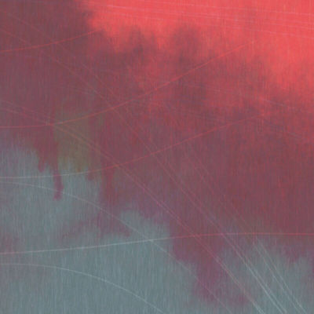
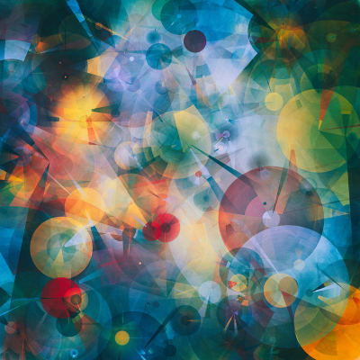

## What is the Canvas API?

The Canvas API, or the ‘HTML5 Canvas’, allows for the creation of dynamic, interactive graphics for the web using JavaScript and the HTML `<canvas>` element. Just as a physical canvas captures paint, the `<canvas>` element captures pixels. These pixels are ‘painted’ with JavaScript (which we might think of as the brush) using the palette of functions provided by the Canvas API (or just Canvas, as I’ll henceforth call the API).

This palette includes a full suite of shape-rendering and pixel-manipulation functions, and popular applications of it include games, animations, annoying advertisements and data visualisations. A lesser-known application, and one which I’ll be leaning towards throughout this series, is generative art (examples of which I include below).

<figure class="flex gap-4">
  
  
</figure>
<figcaption>Linear II by Tyler Hobbs, and Cuda by Manol Gamboa Naon</figcaption>

Although technically capable of 3D graphics (via WebGL, which also renders to the canvas element), most discussions online of Canvas assume that we are referring to its 2D rendering capabilities, or its 2D ‘context’. I’ll explain more about this context later in this series, but for now, it’s generally safe to assume that Canvas is roughly synonymous with 2D web graphics.

## Some More Context

The `<canvas>` element began its life in 2004 as an addition to Apple’s OS X WebKit component, the engine behind their Safari browser. Upon its release, this fledgling element was met with some backlash from the web development community, due in part to Apple’s apparent lack of concern for pursuing an open, consensus-driven approach to the evolution of the web. [As Ian Hickson put it at the time](http://ln.hixie.ch/?start=1089635050&count=1):

> Here is Apple introducing their own proprietary markup to the Web, without going through any sort of standardisation first.

Canvas was however soon adopted by other browsers, and what began as a proprietary extension eventually became open and standardized. [In 2014](https://www.w3.org/blog/news/archives/4167) - ten years later - it was incorporated into the official W3C HTML5 specification.

What made Canvas such an attractive addition to the web technology stack was its promise of performant, low-level procedural graphics, native to the web. Before this, if you wanted to develop games or other graphics-intensive applications online, Flash was your weapon of choice. And Flash, developed in-house at Adobe, required a plugin to work, was notoriously slow (particularly on mobile), and security-wise it was about as watertight as a spaghetti strainer.

Canvas has suffered from none of these drawbacks, and has certainly helped dethrone Flash as the go-to choice for the development of online games, animations and other interactive media. It isn’t, however, the only game in town when it comes to 2D web graphics.

## What's Your Vector Victor?

SVG, which stands for Scalable Vector Graphics, was a specification released by the W3C all the way back in 2001, and it was, in some respects at least, arguably a more appropriate replacement for Flash than was Canvas. SVG, like Flash, is vector-based, and offers several possibilities with regards to animation. So why, you might ask, did we need Canvas at all?

Well, it turns out that releasing a well-thought-out web specification doesn’t mean that browser vendors will automatically adopt it. Browsers have been a long time dragging their feet where SVG support is concerned, and it was only with the rise of high-resolution and high-density (a.k.a. ‘retina’) displays that SVG began to come into its own and get the adoption it deserved.

This should give us a clue as to one of the main differentiators between SVG and Canvas; SVG, because it is vector-based, allows for resolution-independent rendering. Canvas, on the other hand, is bitmap-based, and thus resolution dependent. Zooming in on (i.e. scaling) a canvas element will result in pixelation, whereas SVG elements will remain crisp and clear no matter the scale factor.

Before we rush to any judgement as to which one is ‘better’, we need to bear in mind that SVG and Canvas take very different approaches to how they handle graphics, and thus have their own strengths and weaknesses. I won't go into a detailed comparison here (there's a [nice and readable one over at CSS Tricks](https://css-tricks.com/when-to-use-svg-vs-when-to-use-canvas/) if you fancy diving deeper); suffice to say, SVG is great for graphics that need to remain crisp at higher resolutions and don't have a thousand moving parts. Canvas on the other hand is great at programming graphics of the latter variety (think particle systems or complex music visualisations), but wouldn't be your go-to choice for a high-resolution logo.

## What's Next?

In [the next part of the series](/the-canvas-api-part-2-basic-shapes-and-the-2d-context/), we'll get started using `<canvas>`, showing you how to declare and use its 2D context and create some basic shapes.
