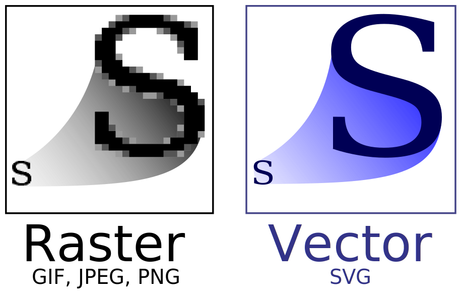



*Update 2025: this was originally to be a series but later developed into [a book on Generative Art and SVG](/generative-art-javascript-svg/)*.

## Introducing SVG

Back in the early days of the web, when dial-up modems dominated and connecting to the internet was anything but instant (and was accompanied but its own - now legendary - audible artifacts), bandwidth came at a premium. File sizes had to be super small if you wanted a page to load in your lifetime, and bitmap images, such as JPGs and PNGs, were the main bandwidth bottleneck.

Bitmap - also known as raster - images are comprised of large chunks of data (or bits), and generally speaking, if you want a larger image, you need more bits, which means a bigger file size. SVG, on the other hand, is a vector format that can be scaled to any dimension, all without a corresponding increase in file size. This is possible because it doesn't bother itself with the bits and pixels needed to paint the image to the screen, but rather _describes_ the image to be rendered at a higher level. And it does this in much the same way that HTML describes the structure and content of a webpage. [As MDN puts it](https://developer.mozilla.org/en-US/docs/Web/SVG):

> SVG is, essentially, to graphics what HTML is to text.

SVG was officially released by the W3C all the way back in 1999, but web browsers, perhaps not appreciative of the power of this new format and the problems it could help solve, were extremely slow to introduce support. SVG only really got the support it deserved with the rise of responsive design and retina (or high PPI) screens; screens which exposed the furry edges and blurry innards of bitmap images not specially prepared for these displays. For SVGs, however, the transition would be effortless, and the results dazzlingly crisp.

## First Strokes

Getting started with SVG is surprisingly simple. All you need are some opening and closing `<svg>` tags, and within that you can start declaring some shapes (I use the word declaring quite deliberately, as SVG is what's known as a _declarative_ language). The below is an example of a self-closing `<circle>` element, its position defined by its centre on the x and y axes (`cx` and `cy`). The `r` stands for the radius, and the `fill` and `stroke` attributes define its colours (the stroke being the outline). SVG is quite strict when it comes to correctly closing tags, so without the closing backslash `/>` on the example below the circle would fail to render.

{{ codepen('Creative Coding with SVG Part 1 - Example 1', 'KKWxJLE', 265, 'html', true) }}

A couple of things worth noting at this point: the size of an SVG will default to 300 x 150 pixels if no width and height are explicitly defined, and if you're writing an SVG document outside of HTML (i.e. saving it as its own SVG file) you should include the xmlns namespace declaration. We'll include it below in our example of a simple rectangle.

{{ codepen('Creative Coding with SVG Part 1 - Example 2', 'LYWgKYZ', 265, 'html', true) }}

Unlike `<circle>` elements, `<rect>` elements aren't drawn from their centre outwards, but from their top left corner (which is why we use `x` and `y` rather than `cx` and `cy` to define the starting position). From there we define the `width`, `height`, `fill` and `stroke`, this time adding in a `stroke-width` value of 10 to define the thickness of the outline. The last attribute, `rx`, refers to the horizontal corner radius; this is what gives the rectangle that rounded-corner effect. (You can also use `ry` if you want the vertical corner radius to differ from the horizontal; leaving it undefined means it will default to the same value.)

## ViewBox Values

The `viewBox` is an attribute of the `<svg>` element that defines the position and dimensions of an SVG viewport, in user space. What does that mean exactly? Well, we can think of user space as unitless, or unit-independent, space. A value of 100 might mean pixels, millimeters, meters, whatever. It will default to pixels, but the point of the `viewBox` is that it can free us from thinking in absolute units. Personally, I like my SVGs set to a width and height of 1000, as I find it intuitive to divide up a canvas that way. Those 1000 units could later be squeezed into a square 500px wide, or stretched to one ten times that size.

The first two values of the `viewBox` define its starting co-ordinates (`min-x` and `min-y`) and the second two define the `width` and `height`. When paired with `preserveAspectRatio`, another top-level `<svg>` attribute, it's possible to alter the behaviour of the `viewBox` quite dramatically, but we're going to keep things simple for now and stick with the defaults.

To best understand how the `viewBox` works, it can help to visually play around with its values. In the following pen, try dragging the sliders back and forth.

{{ codepen('Creative Coding with SVG Part 1 - Example 3', 'QWpzLNd', 410, 'html', true) }}

As you'll see from varying the `min-x` and `min-y` values, the `viewBox` starting co-ordinates function somewhat similarly to how a camera viewfinder frames its subject, and changing the relative width and height of the `viewBox` is a little like zooming in and out.

Most of the time you may not have much reason to pay attention to `viewBox` values, but they can be put to some interesting creative uses; for example, your SVG could contain a lot more content than is visible at any one time, and the `viewBox` could be used to scroll through or act as a stage for animated elements.

## Wrapping Up

In the next part of the series, we'll look at more ways to create shapes, and how to add gradients and groups elements together.
