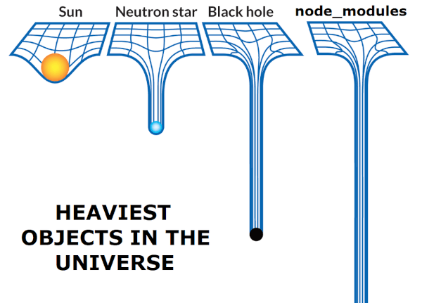

When I first discovered the benefits [SASS](https://sass-lang.com/) (Synatically Awesome Style Sheets) could bring over plain old CSS, I was an immediate convert. Variables, nesting, partials, mixins and minified output all combined to make writing - and more importantly, maintaining - CSS so much more pleasurable. For a while at least.

Now, it's lost its lustre a little, and I've reverted to writing plain good old CSS again. If you have felt similarly tempted, or aren't sure in the first place whether switching to SASS is worth it, here are some reasons to stick with CSS.

## Dynamic Variables

Being able to use variables was one of the first draws of SASS; defining colours, font sizes, breakpoints, or any other values repeated ad nauseum throughout a sprawling stylesheet made for less painful maintenance, and easier experimentation.

```css
// A SASS/SCSS-style variable
$coolGrey = '#8C92AC';

body {
  color: $coolGrey;
}
```

But then CSS released its own variables (you might also see them called custom properties). Agreed, the syntax wasn't quite as elegant, and it would be quite some time before support was sufficiently widespread to make their adoption anything more than experimental.

```css
/* A CSS variable (with global scope). */
:root {
  --coolGrey: #8C92AC;
}

body {
  color: var(--coolGrey);
}
```

However, support is pretty solid now (according to the trusty [caniuse](https://caniuse.com/css-variables)[.com](https://caniuse.com/css-variables)) and what's more, CSS variables have a significant edge over their SASS counterparts: they are dynamic. Once they are set, their value is not fixed. They can be updated in real-time with CSS or JavaScript. Think of a button to quickly toggle the visible theme on a web app UI or website; CSS variables make such features much simpler to implement. SASS variables on the other hand are lost as soon as they are compiled. And other features - like local/global scoping and fallback values - give us further reasons to favour CSS variables.

Granted, you could still use them within a SASS setup, but it is one less reason to use SASS in the first place.

## Did I Ever Need Nesting?

At the start, I was all for nesting; it made so much sense to organise styles hierarchically to mirror the markup structure. It also made it easier to keep the code DRY (Don't Repeat Yourself). Or so I thought.

```css
nav {
  display: flex;
  ul {
    list-style-type: none;
    li {
      display: flex;
      align-items: center;
    }
  }
}
```

Soon I fell into the trap of over-zealously nesting elements, sometimes four or five levels deep. This lead to its own problems, prime among them being that my code was becoming needlessly verbose in an entirely new way. For each media query breakpoint, for example, I'd have to replicate the nested structures so as to ensure the styles would take effect (remember, specificity overrides all else with CSS), and searchability was also becoming an issue. Nesting and naming aren't natural bed buddies.

All this doesn't necessarily mean nesting is bad; restrict yourself to two or three levels and you'll be fine. For me though, nesting is something I'll happily let go to the birds.

## Loops and Mixins; Will I Miss Them?

Perhaps a little. The few times I did use loops I was quite pleased with the results. Well, maybe on occasion I was more pleased with myself, indulging in that fanciful 'I am so smrt smart' feeling that can come with bumming code down to fewer and fewer bytes than you ever thought possible. The below code for example, which adds a stagger-effect delay to some social icons on my site, would take considerably more lines to achieve with vanilla CSS:

```css
// An example of an SCSS loop.
.social-icons {
  @for $i from 1 through 6 {
    a:nth-child(#{$i}) {
      animation-delay: $i * 0.2s;
    }
  }
}
```

There's a caveat here though: when you find yourself reaching for such functionality, you should ask yourself whether JavaScript is the more suitable and/or performant choice. And ensure you inspect the compiled CSS, to make sure it's not overly bloated.

Mixins are more innocuous in this respect, meaning there's less chance they'll lead to unanticipated bloat. They can be excellent for keeping code DRY, and the ability to use arguments too makes them uncannily akin to the kind of functions you'd typically find only in full-fledged programming languages.

Let's not forget though that CSS does boast its own (often overlooked) assortment of functions. You might not be used to thinking of them as such, and probably use them all the time, but there are some you might be unfamiliar with. Revisist them [here in this excellent guide on CSS Tricks](https://css-tricks.com/complete-guide-to-css-functions/).

## From Partials to Parcel

Before I could transition back to CSS, I needed a replacement for partials. SASS partials allow you to split code into several files, and `@import` and minify them later at build-time. This was invaluable to me.

But doesn't CSS have its own `@import` function? Yes, it does, but it's to be avoided at all costs if you care a tot about performance. Here's [a detailed look at why from GTMetrix](https://gtmetrix.com/avoid-css-import.html).

Ok so, I needed a build tool. Something less annoying to configure than Webpack. One thing I never understood about Webpack was its lack of out-of-the-box support for CSS and SASS, as it clearly advertises itself as a bundler for all sorts of web development assets, styles included. But getting these set up I've found to be unnecessarily complicated.

[Parcel](https://parceljs.org/) to the rescue! This was a refreshingly feature-complete bundler with built-in support for HTML, CSS _and_ SASS (should I need it); no extra loaders or plugins needed. Now I could finally streamline the building of both my JS and CSS with a single tool, and be SASS-free in the process.

## Parting Thoughts

I'd still recommend Parcel even if you continue using SASS; for me, it's solved a few problems simultaneously. I dislike the tendency in front-end development to embrace (what I see as) often-unnecessary complexity (the 'bureacracy' of code you might say), and Parcel seems like an effort to remedy this.

Whether you continue or not to use SASS, I think it's always good to periodically revisit your dependencies and evaluate what you can do without. Less dependencies, less bloat! (Let's... ahem... avoid talking about node modules for now...) :)


