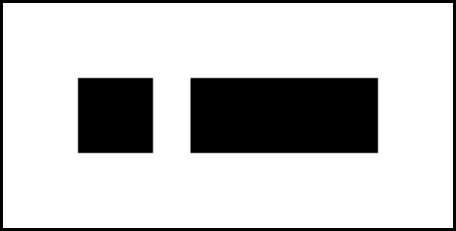
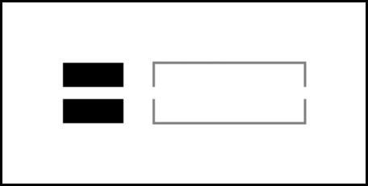
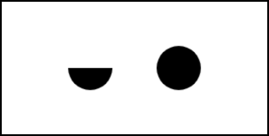
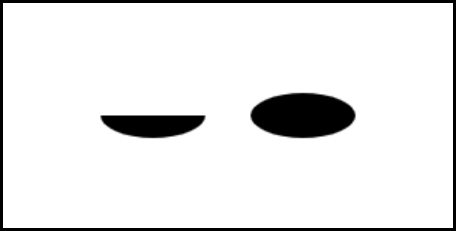

This is part 2 in [a series on the Canvas API](/tag/canvas/).

## Boilerplate

First, create a folder and call it something like `canvas-starter`. Open this folder using your code editor of choice (mine is [VS Code](https://code.visualstudio.com/)) and create a new file called `index.html`. Most code editors will churn out some `HTML` boilerplate using a shortcut of some kind; in the case of VS Code, type `!` and then `tab`, and it should generate something like the below:

```html
<!DOCTYPE html>
<html lang="en">
<head>
  <meta charset="UTF-8">
  <meta name="viewport" content="width=device-width, initial-scale=1.0">
  <title>Document</title>
</head>
<body>

</body>
</html>
```

Next, create the actual `<canvas>` element within the opening and closing body tags, and wrap it in a `<main>` element like so:

```html
<main>
  <canvas></canvas>
</main>
```

For now, we'll keep everything in the one `index.html` document to keep things simple. To complete our boilerplate code add some `<style>` and `<script>` tags into the head and body respectively, so that your markup looks something like this:

```html
<!DOCTYPE html>
<html lang="en">
<head>
  <meta charset="UTF-8">
  <meta name="viewport" content="width=device-width, initial-scale=1.0">
  <style>

    /* Styles go here */

  </style>
  <title>Canvas Starter</title>
</head>
<body>
  <main>
    <canvas></canvas>
  </main>
  <script>

    /* Code goes here */

  </script>
</body>
</html>
```

Add a little CSS between the `<style>` tags so that when you open the file in your browser, you'll actually see something.

```css
canvas {
  border: 2px solid black;
}
```

All this does is add an outline so that we know where the canvas is on the page, but it's a start. We're now ready to move onto the actual coding!

## Fetching the Context

Because the `<canvas>` element is merely a container for graphics, to do anything at all with it (other than position it on the page or style its borders like we've done) we need to use JavaScript. Other than some minor CSS sizing adjustments that we'll get to later, this is henceforth where the focus will be.

The very first thing we need to do is store a reference to the canvas element in a variable. As this variable isn't likely to change, we'll use a constant:

```js
const cnv = document.querySelector('main canvas');
```

Using this variable, we'll then retrieve the canvas _context_. This determines how we're going to interact with the canvas, and the methods available for us to do so. There are [a few options](https://developer.mozilla.org/en-US/docs/Web/API/HTMLCanvasElement/getContext) available to us here, but the one we'll stick with is the 2D rendering context.

Using a one-letter constant for the context will save us some typing later on, as most of the methods we'll be using will need to be prefixed with this.

```js
const c = cnv.getContext('2d');
```

## Squares and Rectangles

The first shapes we'll deal with are squares and rectangles. Because squares are simply rectangles with sides of equal length, one method, `rect()`, will suffice.

The `rect()` method takes four arguments, as follows:

```js
context.rect(x, y, width, height).
```

- `x` : The starting point on the x-axis.
- `y` : The starting point on the y-axis.
- `width` : The width of the rectangle in pixels.
- `height` : The height of the rectangle in pixels.

This is a parameter format you'll see repeated quite often, so going forward I'll just [link to documentation](https://developer.mozilla.org/en-US/docs/Web/API/CanvasRenderingContext2D/rect) rather than elaborate on each parameter. Mozilla's resources are great for readers ready to dig deeper.

Before a rectangle will actually render to the canvas, we'll need to add an additional method, either a [`stroke()`](https://developer.mozilla.org/en-US/docs/Web/API/CanvasRenderingContext2D/stroke) or a [`fill()`](https://developer.mozilla.org/en-US/docs/Web/API/CanvasRenderingContext2D/fill). Every shape has either a stroke (its outline) or a fill (the colour it's filled with), or quite often, you'll see both used together. The important thing to remember is that your shape will need at least one of these methods. We'll explore these both in more detail later, but for now we'll just use the `fill()` method.

```js
// A square starting at x:50 and y:50, 50px wide.
c.rect(50, 50, 50, 50);

// A rectangle, starting at x:125 and y:50, 125px wide and 50px in height.
c.rect(125, 50, 125, 50);

// Fills both shapes, defaulting to black.
c.fill();
```

Here's what you should see at this point:



It's worth pointing out that there are actually three additional `rect()` methods (yes, three!) which provide slight shortcuts to creating the kind of rectangle you're after; [`fillRect()`](https://developer.mozilla.org/en-US/docs/Web/API/CanvasRenderingContext2D/fillRect), [`strokeRect()`](https://developer.mozilla.org/en-US/docs/Web/API/CanvasRenderingContext2D/strokeRect) and [`clearRect()`](https://developer.mozilla.org/en-US/docs/Web/API/CanvasRenderingContext2D/clearRect). The `fillRect()` method draws a filled rectangle, and `strokeRect()` draws a rectangular outline. The `clearRect()` method is a little different; it's essentially a big eraser, and makes the rectangular dimensions you specify completely transparent. It can be particularly useful for clearing the canvas on each frame when animating.

Here are the three methods in action:

```js
// A black square.
c.fillRect(50, 50, 50, 50);

// A rectangular outline.
c.strokeRect(125, 50, 125, 50);

// A transparent area cutting through the center of each.
c.clearRect(0, 70, 300, 10);
```



## Circles, Arcs and Ellipses

Just as there's no dedicated square method, there's no single method for creating circles either. They need to be created using either the [`arc()`](https://developer.mozilla.org/en-US/docs/Web/API/CanvasRenderingContext2D/arc) or [`ellipse()`](https://developer.mozilla.org/en-US/docs/Web/API/CanvasRenderingContext2D/ellipse) methods.

We'll start with the `arc()` method. This takes 5 arguments (and an optional 6th) as follows:

```js
context.arc(x, y, radius, startAngle, endAngle [, anticlockwise]);
```

Keeping our initial canvas constants `cnv` and `c` but commenting out everything else, let's add a couple of `arc()` methods and a `fill()` to illustrate the above:

```js
// An arc with a radius of 25px, starting at 0° and ending at Math. PI (180°).
c.arc(100, 75, 25, 0, Math.PI);

// The same arc moved over to the right, and ending at Math. PI * 2 (360°).
c.arc(200, 75, 25, 0, Math.PI * 2);

// Fill both shapes.
c.fill();
```

Don't let the appearance of `Math.PI` scare you; all you need to know here is that it is the same as 180 degrees (a semicircle) and to get a full circle, you just multiply it by two. If you view your canvas now, you should see a simple circle and semicircle side by side (or a winking/drunken rectangle, if you're prone to [pareidolia](https://en.wikipedia.org/wiki/Pareidolia) like me).



Let's try the same example again, but this time using ellipses instead of arcs. The `ellipse()` method is very similar to the `arc()` method, but if you're going for more of an oval shape, the `ellipse()` method is the more obvious choice. It takes the following format:

```js
context.ellipse(x, y, radiusX, radiusY, rotation, startAngle, endAngle [, anticlockwise]);
```

Let's replace the code of the previous example with the following:

```js
// An oval-shaped ellipse (different x and y radii) ending at 180°.
c.ellipse(100, 75, 35, 15, 0, 0, Math.PI);

// The same oval shape shifted to the right, and filled to 360°.
c.ellipse(200, 75, 35, 15, 0, 0, Math.PI * 2);

// Fill both shapes.
c.fill();
```



This time our drunken rectangle looks like he might throw up all over our keyboard, yikes! :)

If you experimeted with slightly different arguments (e.g. try changing one of the `y` values to `65` instead of `75`) you might have noticed some strange distortions appearing; we'll get to why these happen a little later in the series. For the moment, it's more than enough to familiarise yourself with the arguments these methods take, as there's quite a bit to absorb here.

It might also be helpful at this point to get a refresher on some basic trigonometry; a good resource is [MathIsFun's introductory overview](https://www.mathsisfun.com/algebra/trigonometry.html), with some helpful animations to illustrate core concepts. And another is [this tutorial by Adam Marc Williams](https://www.codedrome.com/trigonometry-in-javascript/), which also uses `<canvas>`.

So what other in-built shape methods does the Canvas API have to offer? Well, it might surprise you to know that this is it! But don't be fooled into thinking that this is a limitation - when we learn about paths and their shape-creating powers, the real capabilities of the Canvas API will being to unfold. With paths, we can create virtually any shape imaginable!

## So What's Next?

Before we get to paths, we should address something else first. If you've been trying out these examples using a screen with a high PPI (pixels-per-inch) ratio (i.e. a screen with an extra crisp resolution, like an iPad or a high-end gaming monitor) you may have noticed that the canvas border is 'sharper' than the shapes therein. Or in other words, the shapes we've created so far have been a tad blurry.

Why is this? We'll take a look at the reasons why, and how to remedy it, in [the next part of the series](/the-canvas-api-part-3-a-retina-ready-responsive-canvas/).
