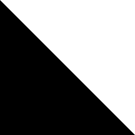
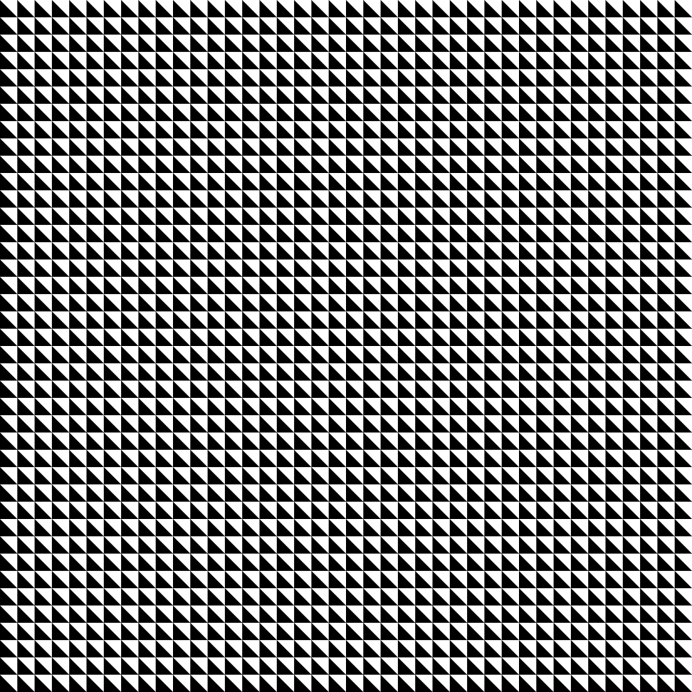
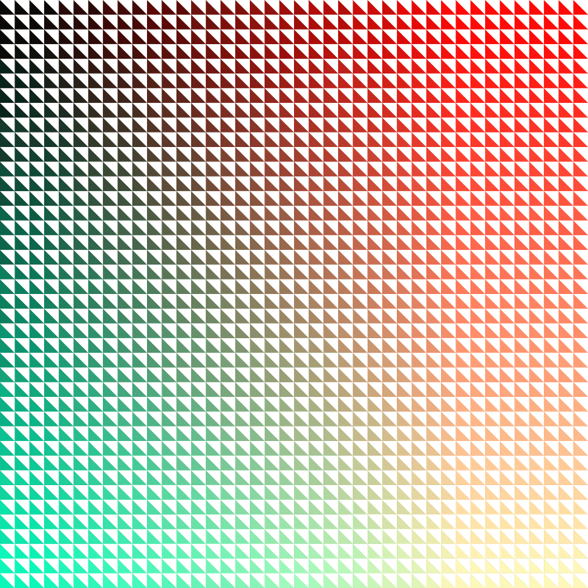
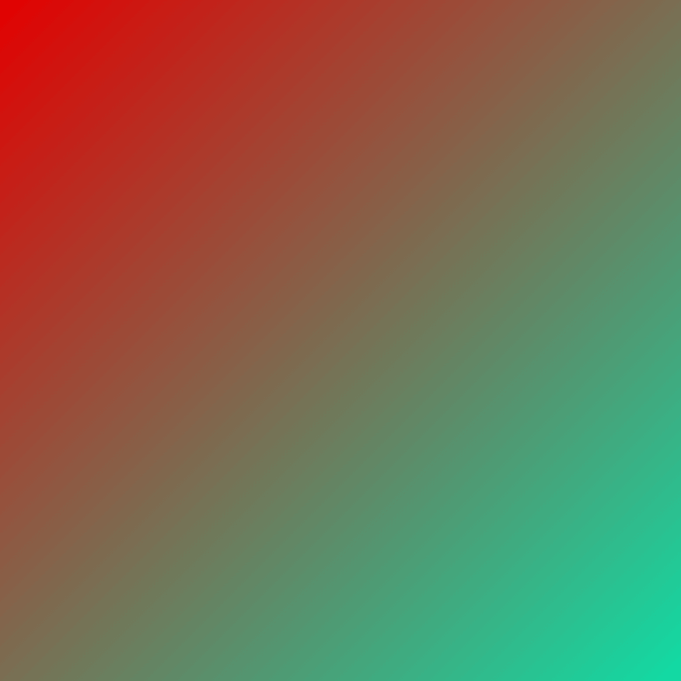
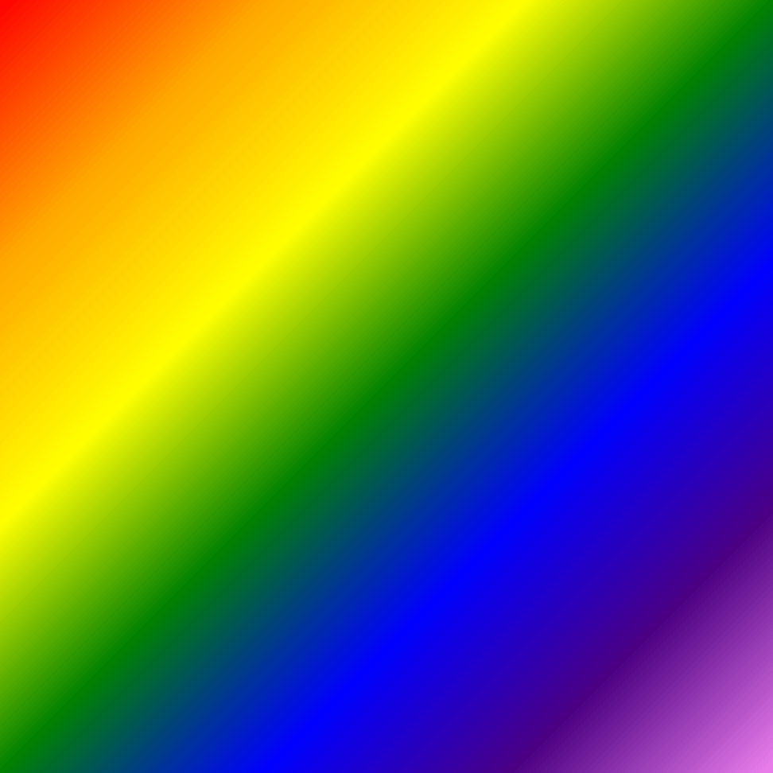
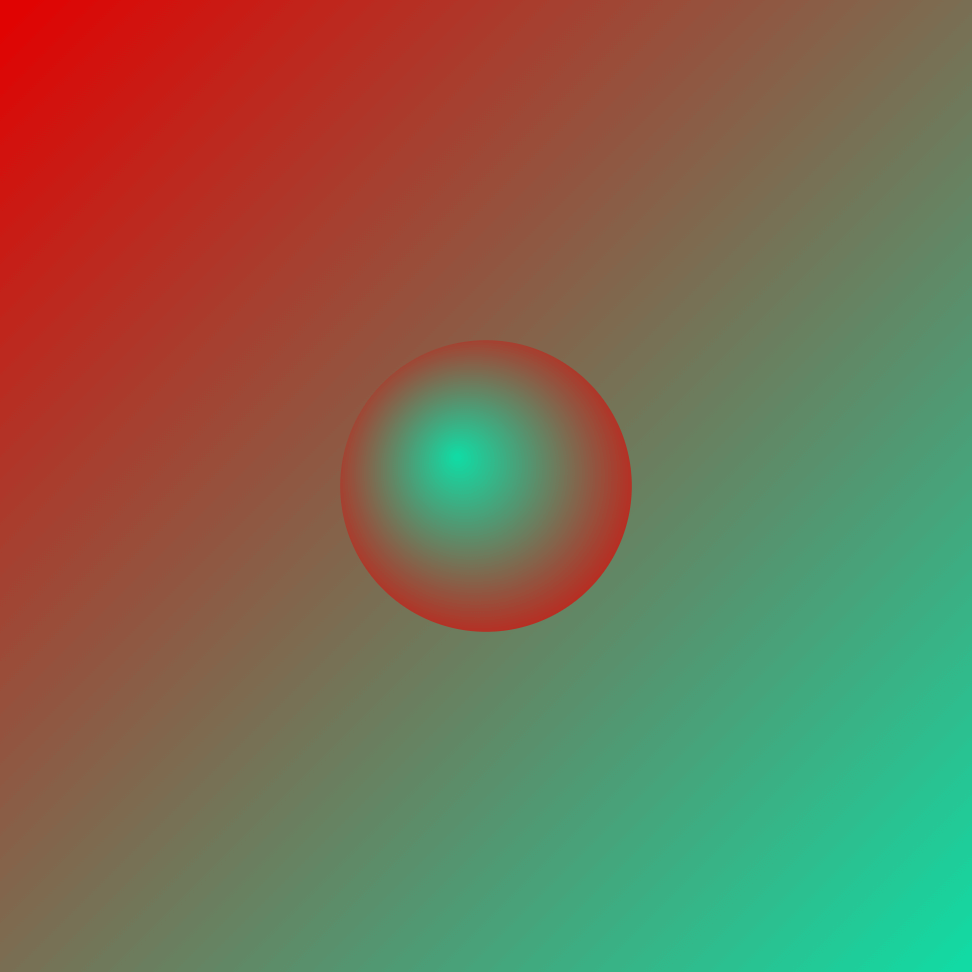

This is part 4 in [a series on the Canvas API](/tag/canvas/).

## Up to this Point

So far, we've covered [how the Canvas API came to be](/the-canvas-api-part-1-the-background/), created some (very) [basic shapes](/the-canvas-api-part-2-basic-shapes-and-the-2d-context/), and set up functions to handle [responsiveness and high-resolution displays](/the-canvas-api-part-3-a-retina-ready-responsive-canvas/). But alas, we haven't created anything interesting, i.e. anything that might spark your own personal creativity. And that should really be the main point of this series.

So let's talk a little more about points, and how they relate to paths. Because paths are where the real power is at.

## The Beginner's Path

The basic shapes we covered so far (various rectangles, the ellipse and the arc) all had, as their first two parameters, the starting points (or co-ordinates) from which they were drawn. These were specified in terms of the x and y axes respectively.

Paths are similar. They consist of individual sets of x and y co-ordinates connected by lines or curves. And they all begin with a simple function called, sensibly enough, [`beginPath()`](https://developer.mozilla.org/en-US/docs/Web/API/CanvasRenderingContext2D/beginPath).

From there, we need to define the co-ordinates of our first point, and we do this with a function called [`moveTo()`](https://developer.mozilla.org/en-US/docs/Web/API/CanvasRenderingContext2D/moveTo). Essentially we shift our position on the canvas to this point before we begin drawing. From there, we use a [`lineTo()`](https://developer.mozilla.org/en-US/docs/Web/API/CanvasRenderingContext2D/lineTo) function to define the next point to draw to, and so on, until we close the path with [`closePath()`](https://developer.mozilla.org/en-US/docs/Web/API/CanvasRenderingContext2D/closePath) and add either a `stroke()` or `fill()` to give the shape some form. All sounds pretty reasonable, right?

Let's illustrate this by drawing a simple triangle. If any of the below code seems unfamiliar, be sure to visit the earlier tutorials.

```js
// Get the HTML5 <canvas> element.
const cnv = document.querySelector('main canvas');

// Make the <canvas> responsive.
responsiveCanvas(cnv);

// Create the context and adapt it to the device pixel ratio.
const c = setPixelDensity(cnv);

// Create a simple right-angled triangle.
c.beginPath();
c.moveTo(10, 10);
c.lineTo(100, 100);
c.lineTo(10, 100);
c.closePath();
c.fill();
```



Now that's about the simplest shape we could have created, but within it lies the essential blueprint for the creation of any number of shapes. But let's stick with it for a moment and see if we can make something a little nicer.

## The Nested For Loop

A very useful technique, and one you'll no doubt come back to again and again if you continue down the road of generative art and web graphics, is the nested for loop (or a loop within a loop). With it you can easily iterate over the entire canvas in both the x and y direction.

The first, or outer, loop takes care of the y-axis (from top to bottom) and the inner loop takes care of the x-axis (from left to right). You start at the top, make a row, move down, make another row etc, until you've completely covered the canvas.

Let's fill our canvas with multiple instances of the triangle we just created.

```js
// Get the width and height, and set a relative unit of measurement.
let s = cnv.getBoundingClientRect();
let w = s.width;
let h = s.height;
let m = w / 1000;

// Set a size for our triangle based on the relative measurement.
let t = 25*m;

// Cover entire canvas with triangles using a nested for loop.
for (let y = 0; y < h; y += t) {
  for (let x = 0; x < w; x += t) {
    c.beginPath();
    c.moveTo(x, y);
    c.lineTo(x + t, y + t);
    c.lineTo(x, y + t);
    c.closePath();
    c.fill();
  }
}
```

What we're doing here first is creating a relative unit of measurement, which for simplicity I call `m`. Before we can do this we need to get the width and height of the canvas. Why are we using [`cnv.getBoundingClientRect()`](https://developer.mozilla.org/en-US/docs/Web/API/Element/getBoundingClientRect) rather than querying the width and height directly via the canvas (i.e. `cnv.width` and `cnv.height`)? Well, because we've played around already with the canvas size and set it relative to the screen pixel density, this is the only way I trust to get a measurement that won't surprise me! Essentially we're bypassing the size the canvas thinks it is, and getting the size it actually is on screen, which might not always coincide.

Based on `m` I'm setting the line-length of our triangle, `t`, to equal `25*m`. The triangle is equilateral so we can use this measurement for all three sides. And we can also use it as the increment value in both our loops (meaning the amount by which the x and y axes increase on each iteration). So the triangle renders at a width and height of `25*m`, then moves over by that amount, renders again, and when it reaches the edge (i.e. the width; `x < w`) of the canvas, we move down a row (activating the next iteration of the outer loop).



Ok, a bit better. If you're on a big screen, you might experience a slight optical illusion - or a kind of optical nauseu - as a result of seeing so many small triangles packed this closely together. Your mind will want to make some kind of sense of this pattern, but may struggle, as it's... not really that interesting. Let's add some colour to remedy that.

## Colour Styles

So far our fills and strokes have all been black by default. To change this is thankfully nice and simple. For fills, we use a property called [`fillStyle`](https://developer.mozilla.org/en-US/docs/Web/API/CanvasRenderingContext2D/fillStyle), and for strokes, we use [`strokeStyle`](https://developer.mozilla.org/en-US/docs/Web/API/CanvasRenderingContext2D/strokeStyle). Both accept a number of different colour formats (e.g. `rgb`, `hsl`, and `hex`) as arguments.

Let's stick with `rgb` for the moment, and take advantage of the fact that we're running a loop. By this I mean capitilizing on the fact that for each iteration, some variables (`x` and `y` specifically) are shifting. Let's use these shifting variables to shade our shapes! (Either x or y will do; in this loop, they are always equal.) Before you call the `fill()` function, insert the following line:

```js
c.fillStyle = `rgb(${0.5*x}, ${0.4*x}, ${0.3*x})`;
```

Here we're using backtick notation - technically known as template literals - to shorten the syntax. It's particularly useful when you need to insert several variables into a string value, as it lets us avoid the more long-winded (and less readable I think) concatentation method.

Refresh your page and you should something like this:



Ok. Our pattern has come a little more to life. :)

## Real Gradients

The foregoing for loop managed to create a gradient effect through iteration, with the shade subtly shifting from black to red, from red to green and then finally fading out to yellow. Each shape though had its own distinct colour. What if we wanted to vary the colour _within_ a shape?

This is where gradients comes in handy. We'll illustrate this with a simple `rect()` and the `[createLinearGradient()](https://developer.mozilla.org/en-US/docs/Web/API/CanvasRenderingContext2D/createLinearGradient)` function. This function takes four arguments; the first two specify the starting co-ordinates, and the second two specify the end co-ordinates. We'll also need to add the colours themselves, and we do this via the [`addColorStop()`](https://developer.mozilla.org/en-US/docs/Web/API/CanvasGradient/addColorStop) function.

```js
// Create a gradient from the top left to the bottom right of the canvas.
let lg = c.createLinearGradient(0, 0, w, h);

// Add the two colours, from 0 (the start) to 1 (the end).
lg.addColorStop(0, '#E30000');
lg.addColorStop(1, '#10DCA5');

// Use the gradient as the fill style and creata a filled rectangle.
c.beginPath();
c.rect(0, 0, w, h);
c.fillStyle = lg;
c.fill();
c.closePath();
```



Here we've added just two colour stops, covering the start and end points, but you could have added as many as you wanted. Here's another example using the colours of the rainbow:

```js
lg.addColorStop(0, 'red');
lg.addColorStop(0.17, 'orange');
lg.addColorStop(0.34, 'yellow');
lg.addColorStop(0.50, 'green');
lg.addColorStop(0.67, 'blue');
lg.addColorStop(0.83, 'indigo');
lg.addColorStop(1, 'violet');
```



One final thing we'll demonstrate before we wrap up this tutorial is the other gradient function, [`createRadialGradient()`](https://developer.mozilla.org/en-US/docs/Web/API/CanvasRenderingContext2D/createRadialGradient). This creates circular gradients emanating out from an inner to an outer circle. It takes two more arguments than its linear counterpart, as it needs a radius defined for each set of x and y co-ordinates. Add the below code to see it in action:

```js
// Create a radial gradient with a slight offset for a 3D effect.
let offset = 30*m;
let rg = c.createRadialGradient((w / 2) - offset, (h / 2) - offset, 1*m, w / 2, h / 2, 200*m);
rg.addColorStop(0, '#10DCA5');
rg.addColorStop(1, '#E30000');

// Create a circle, slightly smaller than the gradient itself, and apply the gradient to it.
c.beginPath();
c.arc(w / 2, h / 2, 150*m, 0, Math.PI * 2);
c.fillStyle = rg;
c.fill();
c.closePath();
```



## Endpoint

That wraps up the basics of the Canvas API for now. Going much further than this would mean digging into domain-specific territory (e.g. trigonometry, image processing, animation etc) and getting away from a general purpose fit-for-all introduction, which was what I intended this to be. The aforementioned topics I do intend to cover, insofar as they relate to generative art and music visualisation, so stay tuned if these are subjects that pique your interest. Bye for now and thanks for reading. :)
