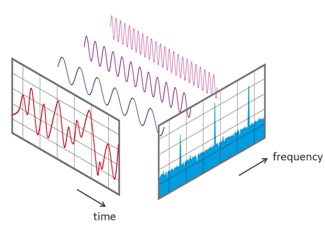



The oscilloscope is what you might call the archetypal audio visualiser, portraying sound in its most essential form. These devices have been around for some time (their origins date back to the late nineteenth century), and the glowing undulating beam they produce is, I'll bet, what springs to most people's minds if asked what sound 'looks like'.

In this tutorial we'll be re-creating this visualisation using JavaScript - specifically, the Web Audio API and HTML Canvas.

Impatient to see the result? Click [here](#conclusion).

## Setting up the UI

Any kind of sound in the browser should be, first and foremost, an event-driven affair. For the sake of user experience, the initialisation of audio events should be triggered by a purposeful user interaction; sound should never surprise the user or happen automatically. If you’ve been ambushed by auto-playing audio in the past you’ll understand how irritating it can be.

What this boils down to is that we need to set up a some simple buttons that allow the user themselves to initialise the audio events. We’re going to have a main on/off button that will start the audio signal, a drop down selection to control the oscillator type, and sliders to control the oscillator frequency and input gain (or volume). And finally, we’ll need a canvas to visualise the resulting waveform. Let’s set these up.

```html
<div id="controls">

  <button id="on-off">Turn On</button>
  <div id="led"></div>

  <label for="osc-type">Oscillator Type</label>
  <select id="osc-type">
    <option value="sine">Sine</option>
    <option value="square">Square</option>
    <option value="sawtooth">Sawtooth</option>
    <option value="triangle">Triangle</option>
  </select>

  <label for="frequency">Frequency: <span id="frequencyValue">440</span></label>
  <input id="frequency" type="range" min="110" max="1760" step="1" value="440">

  <label for="gain">Input Gain: <span id="gainValue">0.5</span></label>
  <input id="gain" type="range" min="0" max="1" step="0.05" value="0.5">

</div>

<canvas id="canvas"></canvas>
```

## Creating the Audio Context and Oscillator

A physical oscillator is, generally, a circuit that produces a periodic, fluctuating (i.e. oscillating) waveform, such as a sine wave or square wave. Its digital counterpart does much the same thing. As you’ll have noticed from the above markup, we’ll be creating an oscillator which can produce waveforms of a few different varieties, including the aforementioned sine and square waves.

Before we can set up an oscillator though, we need to initialise what’s known as an [`AudioContext`](https://developer.mozilla.org/en-US/docs/Web/API/AudioContext). This is the grandaddy of all audio events; without it, the Web Audio API won’t get started at all. The `AudioContext` is an object that represents an audio-processing graph comprised of interconnected audio modules (or nodes). Put more simply, it’s a container for any audio events in the browser.

Creating one is straightforward:

```js
const ac = new AudioContext();
```

An `AudioContext` comes with [several properties and methods](https://developer.mozilla.org/en-US/docs/Web/API/BaseAudioContext) that that will allow us to connect up its nodes to the output speaker (or [`destination`](https://developer.mozilla.org/en-US/docs/Web/API/BaseAudioContext/destination)) and analyse the audio data in order to visualise it. But before we do any audio signal analysis, lets make a little noise.

As previously noted, we need the user to initialise the audio; if we try any funny business (like autoplay our oscillator), our browser will complain. So let’s wrap our code in an event listener function tied to the on-off button we’ve created. First though, we need to declare and initialise a few variables.

```js
let oscillator, isPlaying;

const ac = new AudioContext(),
  powerBtn = document.getElementById("on-off"),
  oscType = document.getElementById("osc-type"),
  freqSlider = document.getElementById("frequency"),
  gainSlider = document.getElementById("gain");
```

We need to declare our `oscillator` as a changeable variable, hence the `let`. The same goes for `isPlaying`, which will be a boolean to keep track of its state.

The other variables below the `AudioContext` capture the HTML elements that we’ve already set up; we’ll need these in our event listener function.

One important thing to note about oscillators in the Web Audio API is that they are designed to be created and discarded as needed; they are essentially single-use entities, and are not computationally expensive to create. The process of starting and stopping an oscillator can seem counter-intuitive at first for newcomers to the Web Audio API, and the API itself is partly to blame. The `stop` method of the [`OscillatorNode`](https://developer.mozilla.org/en-US/docs/Web/API/OscillatorNode) should perhaps be called `remove` (analogous to `remove` method of HTML elements) as you can’t restart a stopped oscillator.

With that in mind, here’s how we’ll structure our `powerBtn` function:

```js
powerBtn.addEventListener("click", () => {
  if (isPlaying) {
    if (oscillator) oscillator.stop();
      powerBtn.innerHTML = "Turn On";
    } else {
      oscillator = new OscillatorNode(ac, {
        type: oscType.value,
        frequency: freqSlider.value
      });
      oscillator.connect(ac.destination);
      oscillator.start();
      powerBtn.innerHTML = "Turn Off";
    }
    isPlaying = !isPlaying;
});
```

So here’s how this works: we first check to see if the oscillator is already playing, in which case the power button should turn it off. However our oscillator might not exist at all yet, so we should also check for that before attempting to use its `stop` method. Once it’s stopped, we update the text of the power button accordingly.

If `isPlaying` is not true, then we create a new `OcscillatorNode`, passing it the `AudioContext` as its first argument, and an object defining its properties as the second argument. Here we’re fetching the DOM variables we created earlier, and using them to define the oscillator `type` and `frequency`.

Next, we connect up the `oscillator` with the `destination` of our `ac` - by default, our computer speakers. It’s then ready to `start`, after which we update the `powerBtn` text and toggle the `isPlaying` boolean.

Now when you click the button, you should hear a 440Hz sine wav. In. All. Its. Glory!

## Controlling the Volume, Frequency and Oscillator Type

At this point, only the `powerBtn` is actually doing anything. Let’s fix that by adding event listeners to the other UI elements. These functions will be more straightforward than that of the `powerBtn`.

```js
freqSlider.addEventListener("input", (event) => {
  let freq = event.target.value;
  document.getElementById("frequencyValue").innerHTML = freq;
  if (oscillator && isPlaying) {
    oscillator.frequency.value = freq;
  }
});

oscType.addEventListener("change", (event) => {
  if (oscillator && isPlaying) {
    oscillator.type = event.target.value;
  }
});

gainSlider.addEventListener("input", (event) => {
  let gain = event.target.value;
  document.getElementById("gainValue").innerHTML = gain;
  if (oscillator && isPlaying) {
    gainNode.gain.value = gain;
  }
});
```

All we’re doing here is using the event listeners to fetch the current values stored in the two input elements (gain and frequency, both of type range) and the select element (controlling the selection of the oscillator type), and then updating appropriate node properties (`gainNode.gain.value`, `oscillator.frequency.value` and `gainNode.gain.value`). These event listener functions are sufficiently similar that you could, if you found yourself creating more of them, set up another function to wrap up any repetitive code. For now though it’s fine, as I won’t be creating further UI elements.

One thing we haven’t done yet however is create a `GainNode` to handle the volume change. So add this to the end of our `const` declarations:

```js
gainNode = new GainNode(ac, {
  gain: 0.5
});
```

As with the `OscillatorNode`, the `GainNode` constructor takes the `AudioContext` as its first argument, and an object defining its properties as the second argument. The next step is to connect up our initialised `gainNode` in the chain of audio nodes. We’ll do that by updating our `powerBtn` function as follows:

```js
powerBtn.addEventListener("click", () => {
  ...
    oscillator.connect(gainNode);
    gainNode.connect(ac.destination);
    oscillator.start();
  ...
});
```

Now we should be able to use our controls to start and stop the oscillator, change its type and frequency, and control the overall volume of the signal.

## Setting up the Canvas

Next we’ll set up our canvas and clean up our UI a little. First, add in the following canvas-related variables. The `sizeOnScreen` and `pixelRatio` variables we’ll use to ensure our canvas resolution is nice and sharp (or ‘[retina-](/the-canvas-api-part-3-a-retina-ready-responsive-canvas/)[ready](/the-canvas-api-part-3-a-retina-ready-responsive-canvas/)’), and the `segmentWidth` will define how we visually slice the audio signal (think of several points spread horizontally across the screen, which are then joined up with a line from one point to the next. The width between each point would be the `segmentWidth`).

```js
let pixelRatio, sizeOnScreen, segmentWidth;

const canvas = document.getElementById("canvas"),
  c = canvas.getContext("2d");
```

The canvas will be the full size of the screen and adapt to the user’s device resolution; this is what the following code takes care of (for a more comprehensive explanation of the below see [here](/the-canvas-api-part-3-a-retina-ready-responsive-canvas/)).

```js
canvas.width = window.innerWidth;
canvas.height = window.innerHeight;
pixelRatio = window.devicePixelRatio;
sizeOnScreen = canvas.getBoundingClientRect();
canvas.width = sizeOnScreen.width * pixelRatio;
canvas.height = sizeOnScreen.height * pixelRatio;
canvas.style.width = canvas.width / pixelRatio + "px";
canvas.style.height = canvas.height / pixelRatio + "px";
```

Now we’ll fill the canvas with an off-black colour (see [why pure black in general is best avoided](https://uxmovement.com/content/why-you-should-never-use-pure-black-for-text-or-backgrounds/)), and then draw a green line from left to right (representing our signal at rest - we’ll get it moving later).

```js
c.fillStyle = "#181818";
c.fillRect(0, 0, canvas.width, canvas.height);
c.strokeStyle = "#33ee55";
c.beginPath();
c.moveTo(0, canvas.height / 2);
c.lineTo(canvas.width, canvas.height / 2);
c.stroke();
```

If you’re completely new to the Canvas API or, you can [brush up on the basics here](/the-canvas-api-part-2-basic-shapes-and-the-2d-context/). To clean up the UI and canvas positioning, you can use something similar to the following CSS:

```css
* {
  box-sizing: border-box;
}

html,
body {
  margin: 0;
  width: 100%;
  font-family: Arial;
}

#canvas {
  position: absolute;
  top: 0;
  left: 0;
  background-color: #181818;
}

#controls {
  position: absolute;
  display: flex;
  flex-direction: column;
  top: 0;
  left: 0;
  z-index: 1;
  background-color: #6666;
  color: #fff;
  padding: 15px 15px 0 15px;
  border-radius: 10px;
  margin: 15px;
  font-size: 11px;
}

#controls button,
#controls select {
  font-size: 11px;
  padding: 2px 0;
}

#controls select,
#controls input,
#controls #led {
  margin-bottom: 15px;
}

#controls button {
  border: 0;
}

#controls label {
  margin-bottom: 5px;
}
```

## Analysing our Signal

Now that we have the canvas set up, how can we go about visualising our sound? What we need is an [`AnalyserNode`](https://developer.mozilla.org/en-US/docs/Web/API/AnalyserNode); this is an audio node that, once plugged into the signal chain, can provide real-time data for us to gather and play with visually. The `AnalyserNode` retrieves data only, and does not modify it. It can provide audio data from two different domains; the frequency domain, and the time domain.

Now, all sound is obviously of a temporal nature, so how are we to understand the difference between the time and frequency domains? The following diagram is what gave me that much-needed ‘aha’ moment:



As you can see, the complex signal represented in the time domain consists of several waves of different frequencies. When viewed from the frequency domain, which is essentially a different perspective or ‘window’ on the same underlying data, we can see the peaks head-on. For an oscilloscope we don’t need this viewpoint; we just want the sound pressure wave as it varies over time. This is what the time domain can provide us with.

So let’s initialise our analyser node, and then an array that will contain our audio data. Our audio data array needs to be initialised either as a float or an integer array - we’ll opt for integer data as that’s sufficient for our purposes (specifically, a [`Uint8Array`](https://developer.mozilla.org/en-US/docs/Web/JavaScript/Reference/Global_Objects/Uint8Array) - an array of 8-bit unsigned integers). Let’s add these to our constants initialised earlier.

```js
analyser = new AnalyserNode(ac, {
  smoothingTimeConstant: 1,
  fftSize: 2048
}),
dataArray = new Uint8Array(analyser.frequencyBinCount);
```

Like the other nodes, the `AnalyserNode` constructor takes the `AudioContext` as its initial argument, and an object defining its properties as the second argument. The `smoothingTimeConstant` is a value between 0 and 1 that defines how smoothly the consecutive values transition to one another, and the `fftSize` represents the size of the [FFT (Fast Fourier Transform)](https://towardsdatascience.com/fast-fourier-transform-937926e591cb) used to split our signal into its spectral components.

For our purposes, all we need to know about the `fftSize` is that it is double the [`frequencyBinCount`](https://developer.mozilla.org/en-US/docs/Web/API/AnalyserNode/frequencyBinCount), and it is the `frequencyBinCount` which determines that amount of data points we’ll have to play with. The `frequencyBinCount` is a read-only property, which is why we need to set the `fftSize` if we want to change it.

The next step is is to connect up the `analyser`. Modify the `powerBtn` function as follows:

```js
powerBtn.addEventListener("click", () => {
  ...
    oscillator.connect(gainNode);
    gainNode.connect(analyser);
    analyser.connect(ac.destination);
    oscillator.start();
    draw();
    powerBtn.innerHTML = "Turn Off";
  ...
});
```

We’ve also introduced a `draw()` function above, which will make use of the browser’s `requestAnimationFrame()` method in order to loop the function in line with the browser’s display refresh rate (usually 60 times per second). What this means is that we’ll be updating our audio data, and hence our visualisation, about 60 times per second. Let’s fill out our `draw()` function, starting with the audio data.

```js
const draw = () => {
  analyser.getByteTimeDomainData(dataArray);
  requestAnimationFrame(draw);
};
```

The [`getByteTimeDomainData()`](https://developer.mozilla.org/en-US/docs/Web/API/AnalyserNode/getByteTimeDomainData) method of the `analyser` takes our `Uint8Array` as its sole argument (if we had chosen to use float data, we’d be using the [`getFloatTimeDomainData()`](https://developer.mozilla.org/en-US/docs/Web/API/AnalyserNode/getFloatTimeDomainData) method instead) and fills that array with time domain audio data. And next we call the `requestAnimationFrame()` method to start our loop.

## Visualising our Signal

Now for the final part. After we call the `getByteTimeDomainData()` method, we’ll define a `segmentWidth` , which will be the width of the canvas divided by the amount of data points we have to work with (equal to the `frequencyBinCount`). Then we’ll clear our canvas on each refresh with our background colour, before initialising the `beginPath()` method that will draw our oscilloscope beam.

```js
segmentWidth = canvas.width / analyser.frequencyBinCount;
c.fillRect(0, 0, canvas.width, canvas.height);
c.beginPath();
```

After we begin a path, we have to specify where to `moveTo()`. We’ll start slightly off-screen (100 pixels to the left) and in the vertical centre. We’ll then check to see if the oscilloscope is playing, and if it is, we’ll run a for loop.

The for loop will iterate over our audio `dataArray` (which as we mentioned, coincides with the `frequencyBinCount`) and draw a line for each point.

```js
c.moveTo(-100, canvas.height / 2);
if (isPlaying) {
  for (let i = 1; i < analyser.frequencyBinCount; i += 1) {
    let x = i * segmentWidth;
    let v = dataArray[i] / 128.0;
    let y = (v * canvas.height) / 2;
    c.lineTo(x, y);
  }
}
c.lineTo(canvas.width + 100, canvas.height / 2);
c.stroke();
```

Calculating the `x` point is straightfoward enough - we just increment it in line with our iterator multiplied by the `segmentWidth`. Our `y` point is a little trickier to calculate. What we need to do here is work out the amplitude of the current audio data point - a number between 0 and 128 - and normalise it to a value between 0 and 1. We assign this to variable `v` and multiply `v` by half the canvas height (as the line is vertically centered) and assign this to our `y` variable. Then we are ready to call our `lineTo()` method, passing it in our `x` and `y` values.

Finally, outside our loop, we complete our line and call the `stroke()` method, which closes the path.

## Conclusion

Now our oscilloscope is complete! Here’s the finished pen if you want to play with it:

{{ codepen('Oscilloscope', 'dyJEbwr', 600) }}

There are lots of places you could take this; you could explore the many other audio processing nodes provided by the Web Audio API ([filters, effects and more](https://noisehack.com/custom-audio-effects-javascript-web-audio-api/)) and build something approaching a full-fledged synthesizer, or further develop our (rather rudimentary) visualisation by adding more [lines, shapes, colours](/the-canvas-api-part-4-points-paths-and-colours/) etc.

Feel free to get in touch if you have any questions, and stay tuned for more tutorials!
