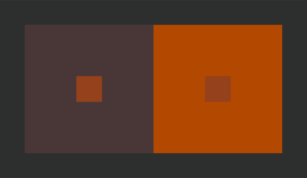
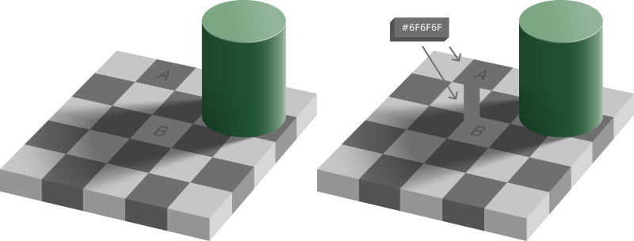
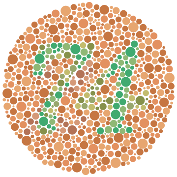
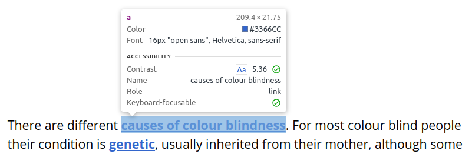

_This post first appeared on [ul.ie](https://www.ul.ie/marketing-and-communications/articles/colour-and-contrast-matter-in-web-accessibility)._

In this article, we’ll look at the role of colour perception in web accessibility, and why anyone involved in publishing content online (whether in the capacity of content editor, designer or developer) can benefit from an awareness of its impact.

## Colour and Context

Colour is always contextual; we don’t perceive it in isolation. The same colour can be perceived differently depending on its surroundings. Take the below example (inspired by the [artist and colour perception pioneer, Josef Albers](https://interactionofcolor.com/)); simple and solid shades of orange and brown sitting side by side. No fancy gradients, just flat colours.

Would it surprise you to know that the smaller inner squares are in fact identical? They may appear to be different colours at first sight, but what’s happening is that their surroundings are seeping into and influencing our perception of them, to the point where the left square appears lighter than the right.

Depth perception adds another layer of complexity to how we process colours. In the below example, we are being influenced by what we _expect_ to see; our brain in brute-force fashion enforces a significant contrast difference between tiles A and B, despite the fact that they are the same colour. Even when we can perceive the proof (on the right) it feels like a trick of some sort.

The takeaway here is that colour perception is relative; deeply so. It makes little sense therefore to think of colours in isolation.

## Can a Colour be Inaccessible?

If we accept the above conclusion, it follows that a colour by itself cannot be inaccessible. Only combinations of colour can be considered accessible or inaccessible. In the below example we can see how a very common font colour (dark gray) can become increasingly illegible as the background colour transitions to a darker shade.

This text is becoming increasingly difficult to read.

This highlights the importance of **colour contrast** in determining web accessibility. It doesn’t matter what the actual colours are; what matters is that there is sufficient contrast between them. The mistake lies in thinking that the background colour is causing the problem above, but the actual problem is that the text isn’t adapting to it. Many users in fact prefer a dark background (or ‘dark mode’) as it can be easier on the eyes, so ideally text and background colour combinations should accommodate this (as in the below example).

This text is sufficiently contrasted from the background.

It’s also worth mentioning here that all this talk of contrast holds for semantic content only, i.e. content intended to convey meaning. The same standards don’t apply to purely decorative images.

## Colours and Disabilities

So far we’ve only considered how colour contrast affects normal-sighted individuals. In making web pages accessible, we also need to think of visually impaired users. **Colour Vision Deficiency** (CVD) [affects approx. 8% of men and 0.5% of women](https://www.colourblindawareness.org/colour-blindness/), and there are a number of different kinds of CVD. If you’re affected by CVD, it should be difficult to discern the number **74** in the below image.

With all these considerations, how is a website designer, developer or content writer supposed to know how to keep their content accessible?

## Measuring Colour Accessibility

Thankfully we have tools to measure accessibility, some of which are built right into your web browser. If you right click on any element on a web page, select ‘Inspect’ and then hit the arrow in the top left corner of the sidebar that opens, you should be able to hover over it and view how accessible the contrast is, as per the below screenshot.

In the Contrast section, what does the number 5.36 mean? This refers to the colour contrast ratio between the background and foreground - 5.36:1 in this case. There is a tick next to it as it is above the minimum colour contrast ratio of 4.5:1, as defined in the [Web Content Accessibility Guidelines (WCAG)](https://www.w3.org/TR/WCAG22/). This rating accounts for colour blindness too, so ensuring your text exceeds this minimum will keep it accessible.

## Summary

- Colour perception is relative.
- Colours in themselves cannot be inaccessible; only colour combinations.
- In making colour combinations accessible, we also need to consider individuals with CVD.
- There are WCAG standards and guidelines you should be aware of as a designer, developer or content creator.
