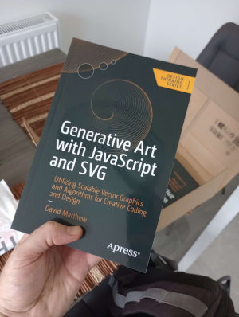



Here you'll find all the CodePen examples accompanying my book <a href="https://link.springer.com/book/10.1007/979-8-8688-0086-3" target="_blank">Generative Art with JavaScript and SVG, published by Apress</a>.

You can also browse the code on Github or download the repository <a href="https://github.com/Apress/Generative-Art-with-JavaScript-and-SVG" target="_blank">here</a>.

## 1. The Beginner's Path

**1.1 Hilma af Klint-inspired Composition**

{{ codepen('Hilma af Klint-inspired Composition', 'eYrVjOw', 358, 'html') }}

**1.2 Cornflower Blue in SvJs**

{{ codepen('Cornflower Blue in SvJs', 'zYLqwZQ', 262, 'js', true) }}

**1.3 Our First Generative Sketch**

Re-run this one for different results.

{{ codepen('Our First Generative Sketch', 'gOjrZZa', 460, 'js', true) }}

## 2. A Programming Primer

**2.1 Web-Safe Colour Spiral**

{{ codepen('Web-Safe Colour Spiral', 'zYLpbvQ', 352, 'js', true) }}

## 3. All About SVG

**3.1 Adjusting the viewBox**

{{ codepen('Adjusting the viewBox', 'yLqRQgB', 460, 'js', true) }}

**3.2 Rectangle Colour Illusion**

{{ codepen('Rectangle Colour Illusion', 'MWBdzrE', 460, 'js', true) }}

**3.3 Circle Overlay Loop**

{{ codepen('Circle Overlay Loop', 'ExrePJG', 460, 'js', true) }}

**3.4 Chalkboard Gag**

{{ codepen('Chalkboard Gag', 'wvNEMVd', 460, 'js', true) }}

**3.5 Optical Illusion**

{{ codepen('Optical Illusion', 'QWYVNLO', 460, 'js', true) }}

## 4. Randomness and Regularity

**4.1 Elements Everywhere All At Once**

{{ codepen('Elements Everywhere All At Once', 'MWLzyjr', 460, 'js', true) }}

**4.2 Regular Grids**

{{ codepen('Regular Grids', 'NWoEbyj', 460, 'js', true) }}

**4.3 Clip Path Patterns**

{{ codepen('Clip Path Patterns', 'bGzQvwL', 460, 'js', true) }}

**4.4 Chance In Action**

{{ codepen('Chance In Action', 'GRzwxzQ', 460, 'js', true) }}

**4.5 Gaussian Distribution**

{{ codepen('Gaussian Distribution', 'ExrOLwm', 460, 'js', true) }}

**4.6 Porto Pareto**

{{ codepen('Porto Pareto', 'ExrOLLv', 460, 'js', true) }}

## 5. The Need for Noise

**5.1 Noise Matrix**

{{ codepen('Noise Matrix', 'MWLZqoW', 460, 'js', true) }}

**5.2 Spinning Noise**

{{ codepen('Spinning Noise', 'wvNNzEN', 460, 'js', true) }}

## 6. The All-Powerful Path

**6.1 Quadratic Slinky**

{{ codepen('Quadratic Slinky', 'poGYZyP', 460, 'js', true) }}

**6.2 Interactive Arc Curve**

{{ codepen('Interactive Arc Curve', 'RwvdBRX', 460, 'js', true) }}

**6.3 Generative Arcs**

{{ codepen('Generative Arcs', 'vYbPaXq', 460, 'js', true) }}

**6.4 Organic Curves**

{{ codepen('Organic Curves', 'abXMjBj', 460, 'js', true) }}

## 7. Motion and Interactivity

**7.1 Cursor Tracking**

{{ codepen('Cursor Tracking', 'YzBgomy', 460, 'js', true) }}

**7.2 Making Things Move**

{{ codepen('Making Things Move', 'jOdJjgZ', 460, 'js', true) }}

**7.3 Collision Detection**

{{ codepen('Collision Detection', 'xxMBovN', 460, 'js', true) }}

**7.4 Circular Loop**

{{ codepen('Circular Loop', 'PoVgYby', 460, 'js', true) }}

## 8. Filter Effects

**8.1 Colour Filter**

{{ codepen('Colour Filter', 'NWomXvy', 460, 'js', true) }}

**8.2 Turbulence**

{{ codepen('Turbulence', 'WNPWdYK', 460, 'js', true) }}

**8.3 Hubble Bubble**

{{ codepen('Hubble Bubble', 'XWOQVor', 460, 'js', true) }}

**8.4 Rough Paper**

{{ codepen('Rough Paper', 'yLZrpGw', 460, 'js', true) }}

**8.5 Rocky Randomness**

{{ codepen('Rocky Randomness', 'RwvOxvg', 460, 'js', true) }}

## 9. The Generative Way

**9.1 Trigonometry**

{{ codepen('Trigonometry', 'NWoZBVG', 460, 'js', true) }}

**9.2 Fractals**

- [Playing with Chaos, by Keith Peters](http://www.playingwithchaos.net/)
- [Fractals, from Chapter 8 of The Nature of Code, by Daniel Shiffman](https://natureofcode.com/book/chapter-8-fractals/)

**9.3 Systems Simulations**

- [The Game of Life | The Coding Train (Daniel Shiffman)](https://thecodingtrain.com/challenges/85-the-game-of-life)
- [Matter.js | A 2D Rigid Body Physics Engine for the Web](https://github.com/liabru/matter-js)
