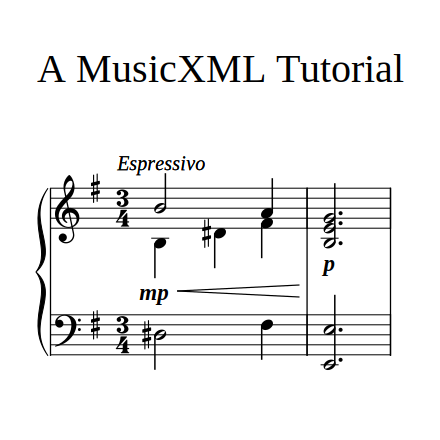
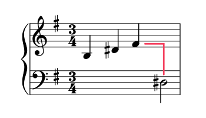



In part two of this blog series, we'll expand on our initial example with some musical directions and dynamics, and demonstrate how to work with multiple staves and voices.

Intended audience: web developers or other coders with an interest in music and/or developing musical applications.

## What We'll Be Creating

To quickly recap on our [first finished example](/a-musicxml-tutorial-part-1-musical-markup-for-the-web/#result), we created a two-bar cadence in E minor, using just the treble clef (i.e. the right hand stave). Taking that as our starting point, we'll work our way towards the following result:



## Ditching the DOM

In the first example I did something a little cheeky - I embedded the MusicXML directly into a `<div>` and referenced it from there. For little snippets we can often get away with this, but it's prone to bugs and not recommended. For example, MusicXML has its own `<p>` element which refers to the _piano_ dynamic marking, and this directly conflicts with HTML's own `<p>` element for paragraphs. When a browser picks up a `<p>` element, it's only going to get interpreted one way (i.e. as HTML, not XML), and this will quickly break any scores with that instruction.

We have a couple of options. We can write the MusicXML markup in either:

1. A JavaScript string literal.
2. A `*.musicxml` file.

The latter is what I recommend, and what I'll be doing when working on the code locally. For the Codepen examples, I'll take the other approach as it means not having to worry about where to host the `*.musicxml` files.

Cutting our MusicXML markup from the DOM (and deleting the containing `<div>`) and pasting it into either a string literal or dedicated file should leave us with the following starting point for this second tutorial:

{{ codepen('MusicXML Tutorial Part 2.1', 'YPzyvNB', 375) }}

## Staves and Clefs

To add staves, we simply declare the number of staves we want within the `<staves>` element. Like the meter and key signature, we declare it once in the first measure's attributes section, and the instruction is carried over into subsequent measures (until explicitly altered).

```xml
<staves>2</staves>
```

In the first example we didn't declare a clef for our single stave, so it defaulted to the treble (or 'G') clef. The same happens if we have two staves; both default to the treble clef. So let's be explicit and use the `<clef>` element to rectify this. Within the `<clef>` element we define a `<sign>` and a `<line>` element; the latter tells us which line of the staff to wrap the clef symbol around, and the sign determines the clef symbol. The treble clef for example has a sign of `G` and a line of `2`, as that's the line the note G wraps around on the right hand stave.

So let's get back to the code. Here's how we set up our two staves with their respective clefs:

```xml
<attributes>
  ...
  <staves>2</staves>
  <clef number="1">
    <sign>G</sign>
    <line>2</line>
  </clef>
  <clef number="2">
    <sign>F</sign>
    <line>4</line>
  </clef>
</attributes>
```

Next, we need to update the notes in the right hand to ensure they remain on the right stave now that we have two. This is easily done with the `<staff>` element. Here's how we'd update the first note:

```xml
<note>
  <pitch>
    <step>B</step>
    <octave>4</octave>
  </pitch>
  <duration>4</duration>
  <type>half</type>
  <staff>1</staff>
</note>
```

The rest we'd update in the same manner (I won't paste them all in here; copy them from the Codepen if needed).

{{ codepen('MusicXML Tutorial Part 2.2', 'zxYoXgb', 440, 'js') }}

## Let's Backup a Minute

Before we tackle the left hand, we need to cover a concept that's crucial for working with multiple staves and voices. Each time we add a note to our score, the duration moves forward a certain amount, and subsequent notes "pick up" from that point in time (with the exception of chord notes). This sequential behaviour works perfectly well when handling a single voice or stave, but what happens when you alter the voice or stave?

Well, let's find out. Add the following `D#` to the end of the first measure:

```xml
<note>
  <pitch>
    <step>D</step>
    <alter>1</alter>
    <octave>3</octave>
  </pitch>
  <duration>4</duration>
  <type>half</type>
  <accidental>sharp</accidental>
  <staff>2</staff>
</note>
```

If you're following along, you'll see something like this:



Instead of starting at the bar's beginning like you might expect, the note continues on as if the three notes in the stave above preceded it. And as far as the markup is concerned, they do. We therefore need some way to rewind or 'backup' the duration, so that the note is correctly placed. We can do this using the `<backup>` element.

The `<backup>` element requires a `<duration>` element, and the duration is what determines how far back we jump. The three notes we've entered thus far have all had a duration of `2`, so that means in order to cycle back to the start of the bar, we need to set the backup duration to `6` (i.e. `3 x 2`). Adding in the following to the first measure just before the `D#` should back us up to the beginning of the bar, fixing the note placement:

```xml
...
</note>
<backup>
  <duration>6</duration>
</backup>
<note>
  <pitch>
    <step>D</step>
    <alter>1</alter>
    <octave>3</octave>
  </pitch>
...  
```

Now we can add that `F` to properly fill out the first bar of the second staff:

```xml
<note>
  <pitch>
    <step>F</step>
    <alter>1</alter>
    <octave>3</octave>
  </pitch>
  <duration>2</duration>
  <type>quarter</type>
  <staff>2</staff>
</note>
```

Filling out the second bar can be done in much the same manner; we again backup our duration by `6` before including our notes. The final two notes on the second staff constitute a chord (or a dyad if we want to get technical), and need to be included just before the closing tag of the second measure:

```xml
<backup>
  <duration>6</duration>
</backup>
<note>
  <pitch>
    <step>E</step>
    <octave>2</octave>
  </pitch>
  <duration>6</duration>
  <type>half</type>
  <dot/>
  <staff>2</staff>
</note>
<note>
  <pitch>
    <step>E</step>
    <octave>3</octave>
  </pitch>
  <duration>6</duration>
  <type>half</type>
  <chord/>
  <dot/>
  <staff>2</staff>
</note>
```

Note: just as there is a `<backup>` element, there is also a `<forward>` element that works in just the same way, but in reverse. We won't have occasion to use it in this tutorial, but it would be remiss of me not to at least make mention of it at this point.

## Voice Leading

The concept of backing up not only opens up the possibility of working with multiple staves, but multiple voices too. Voices allow us to layer complementary melodic lines over existing ones, so as to create new harmonies and/or add to the melodic complexity of a piece. A common example would be choral part-writing where Soprano, Alto, Tenor and Bass voices are woven together to create a richer sound than could be achieved by any one alone.

Using the `<voice>` element, let's add an extra voice to the first measure's treble clef. Just after the closing `<attributes>` tag, add in the following notes:

```xml
...
</attributes>
<note>
  <pitch>
    <step>B</step>
    <octave>4</octave>
  </pitch>
  <duration>4</duration>
  <type>half</type>
  <voice>1</voice>
  <staff>1</staff>
</note>
<note>
  <pitch>
    <step>A</step>
    <octave>4</octave>
  </pitch>
  <duration>2</duration>
  <type>quarter</type>
  <voice>1</voice>
  <staff>1</staff>
</note>
...
```

We've given these notes a voice of `1` because they're in a higher register to the notes that follow. And in accordance with the principles of voice leading, we number voices in descending order, i.e. the higher notes come first.

There's still a couple of things we have to do (as will be apparent if you inspect the score at this point); we haven't set a voice for the rest of the notes in the measure, and we haven't backed up the duration so that they can sit beneath the notes above them. We can remedy this by including the `<backup>` element immediately after the `A` we added above (with the same duration as before), and setting the voice of the notes that follow to `2`.

```xml
<backup>
  <duration>6</duration>
</backup>
<note>
  <pitch>
    <step>B</step>
    <octave>3</octave>
  </pitch>
  <duration>2</duration>
  <type>quarter</type>
  <voice>2</voice>
  <staff>1</staff>
</note>
<note>
  <pitch>  
    <step>D</step>
    <alter>1</alter>
    <octave>4</octave>
  </pitch>
  <duration>2</duration>
  <type>quarter</type>
  <accidental>sharp</accidental>
  <voice>2</voice>
  <staff>1</staff>
</note>
<note>
  <pitch>
    <step>F</step>
    <alter>1</alter>
    <octave>4</octave>
  </pitch>
  <duration>2</duration>
  <type>quarter</type>
  <voice>2</voice>
  <staff>1</staff>
</note>
```

At this juncture, our score should look like this:

{{ codepen('MusicXML Tutorial Part 2.3', 'gbOgBQG', 460, 'js') }}

## Directions and Dynamics

Most scores you encounter in the wild will include not just the notes, but some indication as to how those notes, or indeed the piece itself, should be performed. To this end, we can use the `<direction>` element and its one required child element, `<direction-type>`, which, as you might have guessed, defines the type of direction we want to add. Direction types include dashes, dynamics, words, wedges (like crescendo symbols), pedal markings and more.

The first musical direction that we want to add relates to the piece in general, to indicate that it is to be performed in an expressive manner. We want this direction to appear above the first staff at the start of the score, and in keeping with the custom of the Western classical canon we'll use the Italian term _Espressivo_. This is the form the markup takes, and it should be added right after the attributes section, before the first note:

```xml
...
</attributes>
<direction placement="above">
  <direction-type>
    <words>Espressivo</words>
  </direction-type>
  <staff>1</staff>
</direction>
```

The next direction we want to add is of the dynamics variety, specifically the _mp_ instruction (meaning _mezzo piano_, or moderately quiet). This follows directly on from the first direction, with the placement set to below rather than above the first staff.

```xml
<direction placement="below">
  <direction-type>
    <dynamics>
      <mp/>
    </dynamics>
  </direction-type>
  <staff>1</staff>
</direction>
```

The crescendo marking is next, and this direction is classified as a wedge. The wedge has its own `type` attribute to determine whether it is a crescendo or diminuendo marking. Why an attribute rather than a dedicated element, as was the case with the previous two directions? While the choice can sometimes seem a little arbitrary, in general MusicXML opts for elements over attributes. When an element has a relatively restricted set of options, sometimes an attribute is deemed more appropriate. Again, the next direction follows on from the last:

```xml
<direction placement="below">
  <direction-type>
    <wedge type="crescendo" />
  </direction-type>
  <staff>1</staff>
</direction>
```

If you inspect the score at this point, you should see the _Espressivo_ and _mp_ markings, but where is the crescendo symbol? We can't see it yet because we haven't defined where it should terminate (or 'stop'). We want it to end just shy of the second measure, and for this to happen we need to include another wedge at the very end of the first measure, this time setting its `type` to `stop`.

```xml
...
  <direction placement="below">
    <direction-type>
      <wedge type="stop" />
    </direction-type>
    <staff>1</staff>
  </direction>
</measure>
...
```

The final direction to add is the _p_ dynamic marking below the chord in the second measure. This is nearly identical to the previous _mp_ marking, and can be included just inside the start of the second measure.

```xml
...
<measure number="2">
  <direction placement="below">
    <direction-type>
      <dynamics>
        <p/>
      </dynamics>
    </direction-type>
    <staff>1</staff>
  </direction>
...
```

And that concludes part two of this MusicXML series. Our score should now look like this:

{{ codepen('MusicXML Tutorial Part 2.4', 'azbLGZo', 520, 'js') }}

## Summary

In this tutorial we covered clefs, voices and staves (including the concept of 'backing up' duration within our score) and three different types of musical directions - wedges, words and dynamics. In the next part of the series, we'll delve into ties, beams, a little bit of layout, and how MusicXML can accommodate the MIDI standard.
