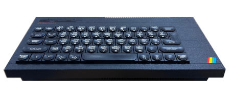

To conclude this series, we have some thoughts and practical tips for MusicXML development from <a href="https://blog.karimratib.me/about/" target="_blank">Karim Ratib</a>.

## About Karim

Karim is a veteran software craftsman actively involved in the MusicXML community, and who is also working on pioneering projects with the aim of bringing more culturally inclusive standards to bear on the world of music software (what he calls his <a href="https://blog.karimratib.me/2025/10/07/music-grimoire-progress-2025.html" target="_blank">Music Grimoire / `music i18n`</a> efforts).

**So let's begin with a bit about your musical background Karim. What role does music play in your day to day life, and how heavily did it feature in your formative years?**

Karim: "Throughout my life, music has played an essential role in my experiences. I remember most of my life events thanks to the music I was listening to when they happened. 

My most enduring social connections were made around music, both listening and playing: family members and childhood friends who introduced me to my early favourites, an uncle who bought me my first guitar, another uncle who took me to see Pink Floyd as a teenager... Playing music with friends in bars throughout college, partnering with those same people later to open a jazz club that's going to this day. All the way to discovering Brazilian music and culture 10 years ago and meeting my beloved current wife there! It's all been under the sign of music.  

I play music almost daily, alone or with friends. I have near-zero creativity - I get my kicks from perfecting progressions, accompanying talented improvisers, putting structure to the music. That's also where music coding / arranging / theory comes in."

 **How did you get involved in music coding and MusicXML to begin with? Has it been part of your 9-to-5 or is it more of a passion project?**

Karim: "My professional journey into music coding started less than 10 years ago. I had the opportunity to work on a few paid contracts in that space but it's definitely a passion project.

If we go back further, my *very first* software program was actually a music one: around 1985, my parents bought me a Sinclair ZX Spectrum 48K+, and after learning BASIC, I participated in a local software competition where I coded a guitar program for a classical piece I was learning at the time: <a href="https://imslp.org/wiki/Rujero_y_Paradetas_(Sanz,_Gaspar)" target="_blank">Rujero y Paradetas by Gaspar Sanz</a>. It is a source of major regret that I didn't keep the listing, but this is the first program that I'm really proud of!"

<figure>
  
  <figcaption>The classic ZX Spectrum 48K+</figcaption>
</figure>

## MusicXML Challenges

**What do you think is the most challenging part of working with MusicXML, i.e. any 'gotchas' that would help prospective developers working with the standard?**

Karim: "MusicXML is an ambitious and complex format that aims to capture orthogonal \[i.e. independent\] concerns:

* How music is logically represented as Common Western Music notation.
* How music notation is laid out on a printable page.
* How music is supposed to sound, including MIDI information.

Given the enormous diversity of use cases of music notation, from jazz lead sheets to orchestral scores, through non-standard tunings and microrhythms, the biggest challenge is to create software that is able to handle the full scope of MusicXML elements and attributes, including implicit behaviours arising from combinations of elements/attributes, but that are not explicitly notated in the schema - at most documented in the textual narrative of the standard, if at all. In fact, none of the many softwares I've used, including commercial ones such as Finale, is able to handle all the valid MusicXML constructs that I've tried, in my comparatively modest experimentation."

> The biggest challenge is to create software that is able to handle the full scope of MusicXML elements and attributes.

## Tips and Tools for Developers

**What advice would you give to aspiring developers hoping to get to grips with the challenges and complexity of MusicXML?**

Karim: "To deal with this complexity in my own MusicXML software, I follow some guidelines that I would also recommend to others:

* Read and re-read <a href="https://w3c.github.io/musicxml/" target="_blank">the MusicXML standard</a> - you will discover new details at every new reading.

* Get involved in <a href="https://github.com/w3c/musicxml/discussions" target="_blank">the MusicXML forum discussions</a> to clarify the spec and seek the advice of community members.

* Define a precise scope for your MusicXML processing, whether for import or export. This scope may be a subset of MusicXML, as opposed to the full generality of the standard, depending on your application.

* For MusicXML import, log the unhandled cases in your code instead of silently ignoring them.

* For MusicXML export, <a href="https://blog.karimratib.me/2020/11/17/validate-musicxml.html" target="_blank">validate your generated files</a> against the XSD schema.

* Use <a href="https://midi.org/community/midi-specifications/looking-for-musicxml-test-files#post-9314" target="_blank">sample MusicXML files</a> for your unit tests.

 **What tools have you found most useful in working with MusicXML, specifically in the context of web development?**

I've assembled a small toolkit that I use whenever I work with MusicXML for web apps. In no particular order:

* <a href="https://www.npmjs.com/package/validate-with-xmllint" target="_blank">Validate with XML Lint</a> to validate MusicXML files (importing or generating) - it uses the binary `xmllint` so this is restricted to `nodejs` and I would love to find a browser-compatible equivalent!

* <a href="https://www.npmjs.com/package/saxon-js" target="_blank">Saxon.js</a> to transform XML files using XSLT and to query XML docs using XPath - this works both in the browser and in `nodejs`. Using XPath for unit testing is an especially effective way to verify transformation rules.

* <a href="https://www.npmjs.com/package/jstoxml" target="_blank">JS to XML</a> to express an XML document in plain JavaScript while constructing it.

* It's worth mentioning that I use <a href="https://developer.mozilla.org/en-US/docs/Web/XML/XSLT" target="_blank">XSLT</a> for any transformation I make on MusicXML files (e.g. to convert to other formats). XSLT is a wonderful language to express transformations in a functional manner with minimal syntactic fuss. Compared to general-purpose procedural languages, the transformation code is much more concise and clearer to follow. There is a definite learning curve for XSLT, but I think the productivity rewards are worth it.

* In terms of a _dependable_ MusicXML renderer to visually verify my work, I've found <a href="https://lilypond.org/" target="_blank">Lilypond</a> to be the best open-source option, ahead of MuseScore. <a href="https://frescobaldi.org/" target="_blank">Frescobaldi</a> provides a very convenient UI to quickly convert MusicXML => Lilypond => Graphical representation.

* In terms of Web-based renderers, I've found  <a href="https://www.verovio.org/index.xhtml" target="_blank">Verovio</a> to be slightly more robust than <a href="https://opensheetmusicdisplay.org/" target="_blank">OSMD</a> and with a much saner API.

## MusicXML and Competing Standards

In the following section we discuss the ostensible successor to MusicXML, <a href="https://w3c.github.io/mnx/docs/" target="_blank">MNX</a>, and another XML format for representing, <a href="https://music-encoding.org/" target="_blank">MEI</a> (Music Encoding Initiative).

**How relevant is MusicXML today? Do you see it being superseded by MNX, or supported alongside it?**

Karim: "Gosh, that's a big question. I do have strong opinions about it...

Consider this: MusicXML 1.0 was released in 2004. 20 years later, we are at MusicXML 4.0 and none of the software I've seen fully supports the spec yet.

This could mean two things:

1. The MusicXML spec is so badly designed that its complexity cannot be feasibly supported fully, or
2. The underlying domain being modeled (music representation) is so complex that ANY spec that attempts to model it will present a challenge to be fully implemented in software.

The designers of MNX seem to think that #1 is the case. Personally, I have reservations about MNX at many levels:

* Philosophically, I lean towards believing #2 with a pinch of #1: Sure, MusicXML is not perfect, but judging from its adoption and usage, it has largely satisfied its purpose and proven itself. To me, the core of the issue is #2: the task of modeling music notation in its full richness is staggeringly difficult. I have trouble believing that a new spec would bring anything other than epsilon-scale improvements over MusicXML. I have yet to find, in the MNX documentation, any clear demonstration of more significant improvements.

* Logistically, the amount of developer-hours that went into MusicXML support, globally across all software that supports it, must be in the millions of hours. The mere thought of restarting this effort with yet another spec strikes me as a major, unneeded distraction. We will simply end up with one more spec that needs to be supported, alongside the many other specs that already exist in this space.

* Architecturally, MNX has recently shifted from an XML format to a JSON format. This is a tremendously backward step as far as I'm concerned. JSON is notoriously ambiguous at the schema level, and its ecosystem of tools is much poorer than XML's. The established, mature standards such as XSD, XPath, XQuery, etc. simply have no equivalent in the JSON world. For a spec as large and deep as music notation, the existence of mature tools is important to assist software maintainers in supporting the spec.

Instead, maintaining and enhancing MusicXML requires comparatively much less effort. I am noticing that the community is actively calling for continued enhancement of the MusicXML standard. Many open issues and discussions in the W3C MusicXML repo are awaiting finalization, while the W3C Music Notation committee is slow to respond and to release new versions that incorporate the results of such discussions. 

To summarize, I don't see MNX reaching a release status any time soon, and I bemoan the fact that our collective attention is wasted on this distraction instead of actively enhancing MusicXML and more fully supporting it."

**In the <a href="" target="_blank">W3 draft spec of MNX</a> it says it aims to avoid the design flaws of MusicXML that have prevented it from being adopted by applications as a native file format (e.g. like Inkscape has adopted SVG), but it's still not clear to me what these actual design flaws are?**

Karim: "I for one have failed to find any concrete examples of how MNX solves alleged shortcomings of MusicXML and the many other notation formats in existence. To be fair, my focus has always been on MusicXML itself so my understanding of MNX is very likely biased!"

**As a spec I do find MEI quite nice, more concise with its heavier use of attributes, whereas MusicXML's use of attributes vs elements I sometimes find a little arbitrary. What's your take on MEI as viewed from a MusicXML perspective? Is it fair to compare the two, or is there too much difference in their stated aims to make a comparison meaningful?**

Karim: "I have been using MEI for a few months now, and I like its design. I agree it is more rigorously defined than MusicXML and I think it is a perfectly viable alternative to the latter. In my experience so far they have been largely compatible."

## Music Internationalisation

**The core philosophy of your music-i18n efforts is really admirable. Could you give a brief summary of it, including how MusicXML fits into the overall vision?**

About 8 years ago, I had the following insight: music software is strongly biased towards Western mainstream music, and most tools are programmed with the “axioms” of this music as their foundation. Things like 12 notes per octave, tuned to intervals that are specific to the 12-TET tuning, with predefined scales and modes - these are hard-coded into the lowest layers of most music software and make it almost impossible to express musical ideas outside this framework.

At the core of my vision is an ecosystem of tools for publishing interactive musical ideas, ultimately delivered through the Web. Essentially, an open-source, standards-based, Unix-inspired, global-music ecosystem.

Of course, Web-based music publishing already exists: It _is_ possible to embed music scores via various platforms. But these platforms are proprietary, commercial, unextensible, and Western-centric. To me, this feels too restrictive for something as important as music. I am aiming for something more inclusive.

> At the core of my vision is ... an open-source, standards-based, Unix-inspired, global-music ecosystem.

To produce an open music publishing system for the Web, we need to build on open standards:

- <a href="https://www.w3.org/2021/06/musicxml40/" target="_blank">MusicXML</a> is the W3C format for music sheet exchange - based on XML that I’ve come to appreciate for its maturity and incredible ecosystem of tools.
- <a href="https://midi.org/specs" target="_blank">MIDI</a> is the 40+ years old (and evolving) standard protocol for communicating musical devices - in our context, it’s used to both encode the music content that is converted from MusicXML (via MIDI files) and to produce the actual sound (via MIDI synths).
- <a href="https://developer.mozilla.org/en-US/docs/Web/API/Web_Audio_API" target="_blank">Web Audio API</a> is the W3C API for producing audio within Web applications.
- <a href="https://developer.mozilla.org/en-US/docs/Web/API/Web_MIDI_API" target="_blank">Web MIDI API</a> is the W3C API for integrating Web applications with MIDI devices.
- <a href="https://www.smufl.org/" target="_blank">SMuFL</a> is a Unicode extension to represent musical symbols, also part of the W3C Music Notation Community Group with maintains MusicXML.

By careful adherence to these standards, music applications can be built to transcend the limiting assumptions of Western mainstream practice.