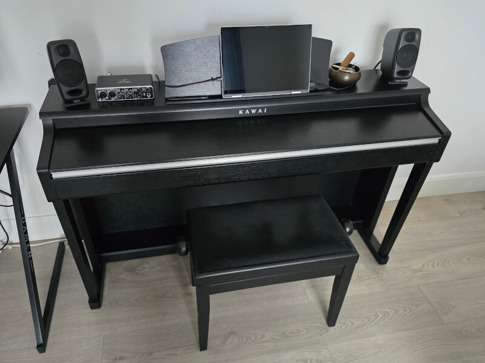

In this short post I'll share how I configured Ubuntu 24.04 LTS for music production, and why I chose this option over Ubuntu Studio.

## My (Minimal) Hardware Setup

In the past I tried to fit my music setup around the PC, but a few years back I swapped the PC for the piano, such that the PC had to play second fiddle to - and fit around - the piano.



The PC eventually became an iPad, and while this allowed me to compose and play freely with lots of innovative instruments, it also presented some problems for me. Specifically:

- Getting tied into Apple's closed ecosystem.
- Upgrading the iPad would usually require new interfaces to connect to it.
- Lacking access to the professional desktop DAWs that I was used to. I was composing but wasn't _producing_ anything on the iPad.

So why not use a Surface or another Windows-based tablet? It's an option, but I prefer Linux for a number of reasons (open source, lack of bloat, no gratuitous AI integration or ads baked into the OS etc). But the deal-breaker often is: can it support the software I most like to use? And can it connect to my hardware?

With the growing number of plug-and-play, class-compliant audio interfaces out there, hardware compatibility isn't nearly as much of an issue as it once was. And the same can be said about software. Here's a rundown of my setup which is all perfectly Linux-compatible.

- **Piano**: Kawai CN24 Digital Piano
- **Tablet**: Dell Inspiron 14 7430, with 16 GB RAM and 12 x i5 Cores
- **Audio Interface**: Behringer U-Phoria UMC204HD
- **Speakers**: IK Multimedia iLoud Micro Monitors
- **DAW**: Cocko's Reaper
- **Main Instruments/FX**: Modartt's Pianoteq, and plugins from U-he and Audio Damage.

## Why Not Use Ubuntu Studio?

It's a good question, and I did, at first. Out of the box it was very impressive and the interface was sleek and extremely customisable. However I ran into a number of issues getting a virtual keyboard to work properly; a bit of a deal-breaker with a tablet. Other issues, like the screen dimming and the sound suddenly getting cut off while playing, made it a bit of a pain to use. Granted, the latter is likely an easy enough fix, but having to tweak things like this in my opinion defeats the purpose of such a distro.

I also didn't like the amount of bloat that came with it. A full install clocks in at nearly 70 GB, full of programs I knew I'd never use, and a clean install of Ubuntu in contrast takes up about 10 GB. The virtual keyboard just worked, and even before making any audio tweaks, I was able to play Pianoteq at a very low latency without any audible artifacts.

## Preparing Your System

If you're not already running Ubuntu, installing it is easier than ever - all you need is a USB stick, the [Ubuntu ISO](https://ubuntu.com/download), and a program like [balenaEtcher](https://etcher.balena.io/) to create a bootable drive.

If you are already running Ubuntu, it's a good idea to make sure everything is up to date before proceeding. Open the terminal (Ctrl + Alt + T) and run:

```bash
sudo apt update && sudo apt upgrade
```

You could reboot at this point just to be on the safe side, but it shouldn't be necessary unless you've been prompted to do so.

## Audio Configuration

While we may not be installing Ubuntu Studio itself, we are going to leverage its installer and audio configuration. Type the following into the terminal:

```bash
sudo apt install ubuntustudio-installer
```

After that, run the installer itself:

```bash
ubuntustudio-installer
```

When you see the message 'Package information successfully refreshed' with a 'Close' button, click it (the wording and red icon is a bit misleading here - the button should really have a green icon and say 'OK' or 'Continue').

When the installer opens, select the following packages (they should be the top three):

- `linux-lowlatency`
- `ubuntustudio-lowlatency-settings`
- `ubuntustudio-performance-tweaks`

We don't need the `ubuntustudio-audio` package - this refers to the bundled software. Click 'Modify Installed Package Selection' and wait for the process to finish. The installer may re-open again afterwards with the same packages selected, which may lead you to think the install wasn't successful, but this is another example of the user experience needing work - this is safe to close.

Finally, run the following command, which will optimally configure your system for audio:

```bash
ubuntustudio-audio-config
```

Your system will likely require a restart at this point, but once the new configuration is active, you're good to go.

## Conclusion

Linux has become a viable option for professional audio production thanks to the efforts of the open source community and proprietary audio software developers alike, and well-crafted distros like Ubuntu Studio deserve their share of credit for this. But it's not the only way to get your system singing. Vanilla Ubuntu is a great option too, and I hope I've shown in this post that optimising it for audio is relatively straightforward and not the pain it might have been the past.
