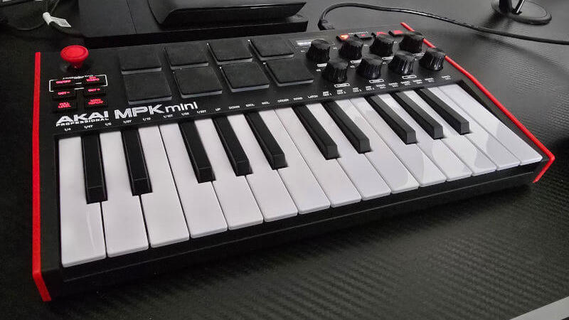
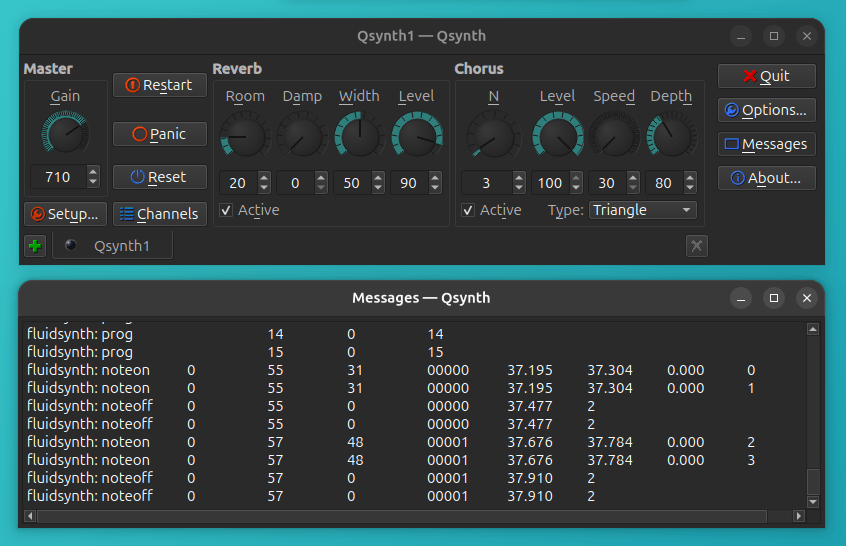

So you've just plugged in your new class-compliant USB MIDI keyboard, loaded up a virtual instrument, tentatively tinkled those keys and... nothing. Your MIDI keyboard isn't even registering. 

This was my own experience recently after having purchased an AKAI MPK Mini, pictured below. In this post, I'll explain how I got it working on a vanilla install of Ubuntu (i.e. an install not yet optimised for audio).



## Getting Your Device Recognised

The first step is to see if your machine is picking up the presence of the USB MIDI keyboard.

### Hardware Level

To check if it's being recognised at the hardware level, open up a terminal and run:

```bash
lsusb
```

The `lsusb` command lists information related to the system's USB ports. You should see output similar to the following:

```bash
Bus 001 Device 001: ID 1d6b:0002 Linux Foundation 2.0 root hub
Bus 002 Device 001: ID 1d6b:0003 Linux Foundation 3.0 root hub
Bus 003 Device 001: ID 1d6b:0002 Linux Foundation 2.0 root hub
...
Bus 003 Device 011: ID 09e8:1049 AKAI Pro M.I. Corp. MPK mini 3
```

In my case, the MPK was listed. If you don't see your keyboard listed:

- Try connecting the keyboard to another USB port, or
- Try using a different USB cable if you have one

It can also be useful at this point to check for any MIDI-related kernel messages by running the `dmesg` command. This utility, which stands for diagnostic messages, prints the message buffer at the kernel level.

```bash
sudo dmesg | grep -i midi
```

### System Level

The next step is to check if the system, specifically ALSA (which stands for Advanced Linux Sound Architecture), is recognising the device.

First make sure you have the MIDI utilities `alsa-utils` and `alsa-tools` installed.

```bash
# Check if they're installed.
apt search alsa

# Install them if not.
sudo apt install alsa-utils alsa-tools
```

Then use the `aplaymidi` command (which can be used to play MIDI files by sending the content to an ALSA MIDI port) with the `-l` flag, which lists all possible MIDI output ports.

```bash
aplaymidi -l
```

The output should look something like the below.

```bash
 20:0   MPK mini 3   MPK mini 3 MIDI 1
```

Again, my device was listed, so the issue wasn't at the device or system level. If your device still isn't recognised, double check if a specific driver is required for your model.

### User Level

Another reason MIDI devices recognised by the system may fail to function has to do with user-level permissions. Your user should be included in the `audio` group. To ensure you're in this group, run the below, replacing `$USER` with your username.

```bash
sudo usermod -aG audio $USER
```

For these changes to take effect, log out and back in again.

## Test with Qsynth

At this point, I need to make an important disclosure: I was testing my keyboard with a browser-based synth (the fantastic <a href="https://www.minimoog.app/" target="_blank">Minimoog web app</a> if interested) so I was perhaps pushing the 'plug-and-play' claims of class-compliance a little far here. Going by the checks performed thus far, my device was working fine.

To confirm it was an issue restricted to the browser rather than my system, I did a quick test with <a href="https://qsynth.sourceforge.io/" target="_blank">Qsynth</a> (available via the Ubuntu App Center). Qsynth is basic but very useful for debugging, with built-in console output. 



It can be helpful to enable verbose MIDI in Qsynth's Setup screen; these can then be inspected via the Messages button. A few quick chords confirmed my MPK was indeed working as expected, as you'll see from the above-captured `noteon` and `noteoff` messages, so my problem wasn't at the hardware or system/operating system level. It was at the application level.

## Browser MIDI vs OS MIDI

MIDI in the web browser requires the Web MIDI API, which works at a higher layer of abstraction than MIDI running via native applications. If you're having issues with web MIDI, which browser you're using and how you installed it become relevant factors.

I was using Chromium installed as a snap package from the App Center, and it turns out this was my issue.

### Sandboxing

Running Chromium via the command line was my next step, with logging enabled.

```bash
chromium --enable-logging --v=1
```

Now when I played the Minimoog, I could see the following error:

```bash
ALSA lib conf.c:4579:(snd_config_update_r) Cannot access file /usr/share/alsa/alsa.conf
```

This could mean a couple of things:

* Either the `alsa.conf` file doesn't exist, or
* Chromium is unable to access this file.

Running the below, I was able to verify that the `alsa.conf` file existed and was readable:

```bash
ls -la /usr/share/alsa/alsa.conf

-rw-r--r-- 1 root root 10117 Jan 30 13:10 /usr/share/alsa/alsa.conf
```

This meant that Chromium couldn't access the file. In other words, it was sandboxed.

The solution? I downloaded a `.deb` version of Chromium to replace the snap package, and then the Web MIDI API worked as expected.

## Summary

To recap, if you're having issues getting a class-compliant USB MIDI keyboard working on Ubuntu or other comparable Debian-based Linux distributions:

* Check the hardware level first (`lsusb`, and try different ports and/or cables)
* Look through kernel messages (`dmesg | grep -i midi`)
* Verify ALSA recognises your device (`aplaymidi -l`)
* Make sure your user is a member of the `audio` group
* Test with a utility like Qsynth
* If using the Web MIDI API, make sure browser access to system resources isn't sandboxed (this was my issue)

I hope this helps other Linux musicians out there!