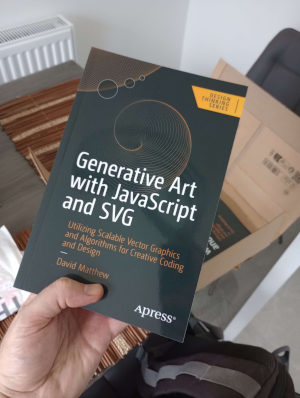

Here you'll find all the CodePen examples accompanying my book <a href="https://link.springer.com/book/10.1007/979-8-8688-0086-3" target="_blank">Generative Art with JavaScript and SVG, published by Apress</a>.

You can also browse the code on Github or download the repository <a href="https://github.com/Apress/Generative-Art-with-JavaScript-and-SVG" target="_blank">here</a>.

## 1. The Beginner's Path

**1.1 Hilma af Klint-inspired Composition**

<iframe height="358" class="codepen" scrolling="no" title="Gen Art Book 1.1 Hilma af Klint-Inspired Composition" src="https://codepen.io/davidmatthew/embed/eYrVjOw?default-tab=html%2Cresult&editable=true&theme-id=dark" frameborder="no" loading="lazy" allowtransparency="true">
  See the Pen <a href="https://codepen.io/davidmatthew/pen/eYrVjOw">
  Gen Art Book 1.1 Hilma af Klint-Inspired Composition</a> by David Matthew (<a href="https://codepen.io/davidmatthew">@davidmatthew</a>)
  on <a href="https://codepen.io">CodePen</a>.
</iframe>

**1.2 Cornflower Blue in SvJs**

<iframe height="262" class="codepen" scrolling="no" title="Gen Art Book 1.2.1 Cornflower Blue in SvJs" src="https://codepen.io/davidmatthew/embed/zYLqwZQ?default-tab=js%2Cresult&editable=true&theme-id=dark" frameborder="no" loading="lazy" allowtransparency="true">
  See the Pen <a href="https://codepen.io/davidmatthew/pen/zYLqwZQ">
  Gen Art Book 1.2.1 Cornflower Blue in SvJs</a> by David Matthew (<a href="https://codepen.io/davidmatthew">@davidmatthew</a>)
  on <a href="https://codepen.io">CodePen</a>.
</iframe>

**1.3 Our First Generative Sketch**

Re-run this one for different results.

<iframe height="460" class="codepen" scrolling="no" title="Gen Art Book 1.3 Our First Generative Sketch" src="https://codepen.io/davidmatthew/embed/gOjrZZa?default-tab=js%2Cresult&editable=true&theme-id=dark" frameborder="no" loading="lazy" allowtransparency="true">
  See the Pen <a href="https://codepen.io/davidmatthew/pen/gOjrZZa">
  Gen Art Book 1.3 Our First Generative Sketch</a> by David Matthew (<a href="https://codepen.io/davidmatthew">@davidmatthew</a>)
  on <a href="https://codepen.io">CodePen</a>.
</iframe>

## 2. A Programming Primer

**2.1 Web-Safe Colour Spiral**

<iframe height="352" class="codepen" scrolling="no" title="Gen Art Book 2.1 Web-Safe Spiral" src="https://codepen.io/davidmatthew/embed/preview/zYLpbvQ?default-tab=js%2Cresult&editable=true&theme-id=dark" frameborder="no" loading="lazy" allowtransparency="true">
  See the Pen <a href="https://codepen.io/davidmatthew/pen/zYLpbvQ">
  Gen Art Book 2.1 Web-Safe Spiral</a> by David Matthew (<a href="https://codepen.io/davidmatthew">@davidmatthew</a>)
  on <a href="https://codepen.io">CodePen</a>.
</iframe>

## 3. All About SVG

**3.1 Adjusting the viewBox**

<iframe height="460" class="codepen" scrolling="no" title="Gen Art Book 3.1 Adjusting the viewBox" src="https://codepen.io/davidmatthew/embed/preview/yLqRQgB?default-tab=result&editable=true&theme-id=dark" frameborder="no" loading="lazy" allowtransparency="true">
  See the Pen <a href="https://codepen.io/davidmatthew/pen/yLqRQgB">
  Gen Art Book 3.1 Adjusting the viewBox</a> by David Matthew (<a href="https://codepen.io/davidmatthew">@davidmatthew</a>)
  on <a href="https://codepen.io">CodePen</a>.
</iframe>

**3.2 Rectangle Colour Illusion**

<iframe height="460" class="codepen" scrolling="no" title="Rectangle Colour Illusion" src="https://codepen.io/davidmatthew/embed/preview/MWBdzrE?default-tab=js%2Cresult&editable=true&theme-id=dark" frameborder="no" loading="lazy" allowtransparency="true">
  See the Pen <a href="https://codepen.io/davidmatthew/pen/MWBdzrE">
  Rectangle Colour Illusion</a> by David Matthew (<a href="https://codepen.io/davidmatthew">@davidmatthew</a>)
  on <a href="https://codepen.io">CodePen</a>.
</iframe>

**3.3 Circle Overlay Loop**

<iframe height="460" class="codepen" scrolling="no" title="Circle Overlay Loop" src="https://codepen.io/davidmatthew/embed/preview/ExrePJG?default-tab=js%2Cresult&editable=true&theme-id=dark" frameborder="no" loading="lazy" allowtransparency="true">
  See the Pen <a href="https://codepen.io/davidmatthew/pen/ExrePJG">
  Circle Overlay Loop</a> by David Matthew (<a href="https://codepen.io/davidmatthew">@davidmatthew</a>)
  on <a href="https://codepen.io">CodePen</a>.
</iframe>

**3.4 Chalkboard Gag**

<iframe height="460" class="codepen" scrolling="no" title="Chalkboard Gag" src="https://codepen.io/davidmatthew/embed/preview/wvNEMVd?default-tab=js%2Cresult&editable=true&theme-id=dark" frameborder="no" loading="lazy" allowtransparency="true">
  See the Pen <a href="https://codepen.io/davidmatthew/pen/wvNEMVd">
  Chalkboard Gag</a> by David Matthew (<a href="https://codepen.io/davidmatthew">@davidmatthew</a>)
  on <a href="https://codepen.io">CodePen</a>.
</iframe>

**3.5 Optical Illusion**

<iframe height="460" class="codepen" scrolling="no" title="Optical Illusion" src="https://codepen.io/davidmatthew/embed/preview/QWYVNLO?default-tab=js%2Cresult&editable=true&theme-id=dark" frameborder="no" loading="lazy" allowtransparency="true">
  See the Pen <a href="https://codepen.io/davidmatthew/pen/QWYVNLO">
  Optical Illusion</a> by David Matthew (<a href="https://codepen.io/davidmatthew">@davidmatthew</a>)
  on <a href="https://codepen.io">CodePen</a>.
</iframe>

## 4. Randomness and Regularity

**4.1 Elements Everywhere All At Once**

<iframe height="460" class="codepen" scrolling="no" title="Elements Everywhere All At Once" src="https://codepen.io/davidmatthew/embed/preview/MWLzyjr?default-tab=js%2Cresult&editable=true&theme-id=dark" frameborder="no" loading="lazy" allowtransparency="true">
  See the Pen <a href="https://codepen.io/davidmatthew/pen/MWLzyjr">
  Elements Everywhere All At Once</a> by David Matthew (<a href="https://codepen.io/davidmatthew">@davidmatthew</a>)
  on <a href="https://codepen.io">CodePen</a>.
</iframe>

**4.2 Regular Grids**

<iframe height="460" class="codepen" scrolling="no" title="Regular Grids" src="https://codepen.io/davidmatthew/embed/preview/NWoEbyj?default-tab=js%2Cresult&editable=true&theme-id=dark" frameborder="no" loading="lazy" allowtransparency="true">
  See the Pen <a href="https://codepen.io/davidmatthew/pen/NWoEbyj">
  Regular Grids</a> by David Matthew (<a href="https://codepen.io/davidmatthew">@davidmatthew</a>)
  on <a href="https://codepen.io">CodePen</a>.
</iframe>

**4.3 Clip Path Patterns**

<iframe height="460" class="codepen" scrolling="no" title="Clip Path Patterns" src="https://codepen.io/davidmatthew/embed/preview/bGzQvwL?default-tab=js%2Cresult&editable=true&theme-id=dark" frameborder="no" loading="lazy" allowtransparency="true">
  See the Pen <a href="https://codepen.io/davidmatthew/pen/bGzQvwL">
  Clip Path Patterns</a> by David Matthew (<a href="https://codepen.io/davidmatthew">@davidmatthew</a>)
  on <a href="https://codepen.io">CodePen</a>.
</iframe>

**4.4 Chance In Action**

<iframe height="460" class="codepen" scrolling="no" title="Chance In Action" src="https://codepen.io/davidmatthew/embed/preview/GRzwxzQ?default-tab=js%2Cresult&editable=true&theme-id=dark" frameborder="no" loading="lazy" allowtransparency="true">
  See the Pen <a href="https://codepen.io/davidmatthew/pen/GRzwxzQ">
  Chance In Action</a> by David Matthew (<a href="https://codepen.io/davidmatthew">@davidmatthew</a>)
  on <a href="https://codepen.io">CodePen</a>.
</iframe>

**4.5 Gaussian Distribution**

<iframe height="460" class="codepen" scrolling="no" title="Gaussian Distribution" src="https://codepen.io/davidmatthew/embed/preview/ExrOLwm?default-tab=js%2Cresult&editable=true&theme-id=dark" frameborder="no" loading="lazy" allowtransparency="true">
  See the Pen <a href="https://codepen.io/davidmatthew/pen/ExrOLwm">
  Gaussian Distribution</a> by David Matthew (<a href="https://codepen.io/davidmatthew">@davidmatthew</a>)
  on <a href="https://codepen.io">CodePen</a>.
</iframe>

**4.6 Porto Pareto**

<iframe height="460" class="codepen" scrolling="no" title="Porto Pareto" src="https://codepen.io/davidmatthew/embed/preview/ExrOLLv?default-tab=js%2Cresult&editable=true&theme-id=dark" frameborder="no" loading="lazy" allowtransparency="true">
  See the Pen <a href="https://codepen.io/davidmatthew/pen/ExrOLLv">
  Porto Pareto</a> by David Matthew (<a href="https://codepen.io/davidmatthew">@davidmatthew</a>)
  on <a href="https://codepen.io">CodePen</a>.
</iframe>

## 5. The Need for Noise

**5.1 Noise Matrix**

<iframe height="460" class="codepen" scrolling="no" title="Noise Matrix" src="https://codepen.io/davidmatthew/embed/preview/MWLZqoW?default-tab=js%2Cresult&editable=true&theme-id=dark" frameborder="no" loading="lazy" allowtransparency="true">
  See the Pen <a href="https://codepen.io/davidmatthew/pen/MWLZqoW">
  Noise Matrix</a> by David Matthew (<a href="https://codepen.io/davidmatthew">@davidmatthew</a>)
  on <a href="https://codepen.io">CodePen</a>.
</iframe>

**5.2 Spinning Noise**

<iframe height="460" class="codepen" scrolling="no" title="Spinning Noise" src="https://codepen.io/davidmatthew/embed/preview/wvNNzEN?default-tab=js%2Cresult&editable=true&theme-id=dark" frameborder="no" loading="lazy" allowtransparency="true">
  See the Pen <a href="https://codepen.io/davidmatthew/pen/wvNNzEN">
  Spinning Noise</a> by David Matthew (<a href="https://codepen.io/davidmatthew">@davidmatthew</a>)
  on <a href="https://codepen.io">CodePen</a>.
</iframe>

## 6. The All-Powerful Path

**6.1 Quadratic Slinky**

<iframe height="460" class="codepen" scrolling="no" title="Quadratic Slinky" src="https://codepen.io/davidmatthew/embed/preview/poGYZyP?default-tab=js%2Cresult&editable=true&theme-id=dark" frameborder="no" loading="lazy" allowtransparency="true">
  See the Pen <a href="https://codepen.io/davidmatthew/pen/poGYZyP">
  Quadratic Slinky</a> by David Matthew (<a href="https://codepen.io/davidmatthew">@davidmatthew</a>)
  on <a href="https://codepen.io">CodePen</a>.
</iframe>

**6.2 Interactive Arc Curve**

<iframe height="460" class="codepen" scrolling="no" title="Interactive Arc Curve" src="https://codepen.io/davidmatthew/embed/preview/RwvdBRX?default-tab=js%2Cresult&editable=true&theme-id=dark" frameborder="no" loading="lazy" allowtransparency="true">
  See the Pen <a href="https://codepen.io/davidmatthew/pen/RwvdBRX">
  Interactive Arc Curve</a> by David Matthew (<a href="https://codepen.io/davidmatthew">@davidmatthew</a>)
  on <a href="https://codepen.io">CodePen</a>.
</iframe>

**6.3 Generative Arcs**

<iframe height="460" class="codepen" scrolling="no" title="Generative Arcs" src="https://codepen.io/davidmatthew/embed/preview/vYbPaXq?default-tab=js%2Cresult&editable=true&theme-id=dark" frameborder="no" loading="lazy" allowtransparency="true">
  See the Pen <a href="https://codepen.io/davidmatthew/pen/vYbPaXq">
  Generative Arcs</a> by David Matthew (<a href="https://codepen.io/davidmatthew">@davidmatthew</a>)
  on <a href="https://codepen.io">CodePen</a>.
</iframe>

**6.4 Organic Curves**

<iframe height="460" class="codepen" scrolling="no" title="Organic Curves" src="https://codepen.io/davidmatthew/embed/preview/abXMjBj?default-tab=js%2Cresult&editable=true&theme-id=dark" frameborder="no" loading="lazy" allowtransparency="true">
  See the Pen <a href="https://codepen.io/davidmatthew/pen/abXMjBj">
  Organic Curves</a> by David Matthew (<a href="https://codepen.io/davidmatthew">@davidmatthew</a>)
  on <a href="https://codepen.io">CodePen</a>.
</iframe>

## 7. Motion and Interactivity

**7.1 Cursor Tracking**

<iframe height="460" class="codepen" scrolling="no" title="Cursor Tracking" src="https://codepen.io/davidmatthew/embed/preview/YzBgomy?default-tab=js%2Cresult&editable=true&theme-id=dark" frameborder="no" loading="lazy" allowtransparency="true">
  See the Pen <a href="https://codepen.io/davidmatthew/pen/YzBgomy">
  Cursor Tracking</a> by David Matthew (<a href="https://codepen.io/davidmatthew">@davidmatthew</a>)
  on <a href="https://codepen.io">CodePen</a>.
</iframe>

**7.2 Making Things Move**

<iframe height="460" class="codepen" scrolling="no" title="Making Things Move" src="https://codepen.io/davidmatthew/embed/preview/jOdJjgZ?default-tab=js%2Cresult&editable=true&theme-id=dark" frameborder="no" loading="lazy" allowtransparency="true">
  See the Pen <a href="https://codepen.io/davidmatthew/pen/jOdJjgZ">
  Making Things Move</a> by David Matthew (<a href="https://codepen.io/davidmatthew">@davidmatthew</a>)
  on <a href="https://codepen.io">CodePen</a>.
</iframe>

**7.3 Collision Detection**

<iframe height="460" class="codepen" scrolling="no" title="Collision Detection" src="https://codepen.io/davidmatthew/embed/preview/xxMBovN?default-tab=js%2Cresult&editable=true&theme-id=dark" frameborder="no" loading="lazy" allowtransparency="true">
  See the Pen <a href="https://codepen.io/davidmatthew/pen/xxMBovN">
  Collision Detection</a> by David Matthew (<a href="https://codepen.io/davidmatthew">@davidmatthew</a>)
  on <a href="https://codepen.io">CodePen</a>.
</iframe>

**7.4 Circular Loop**

<iframe height="460" class="codepen" scrolling="no" title="Circular Loop" src="https://codepen.io/davidmatthew/embed/preview/PoVgYby?default-tab=js%2Cresult&editable=true&theme-id=dark" frameborder="no" loading="lazy" allowtransparency="true">
  See the Pen <a href="https://codepen.io/davidmatthew/pen/PoVgYby">
  Circular Loop</a> by David Matthew (<a href="https://codepen.io/davidmatthew">@davidmatthew</a>)
  on <a href="https://codepen.io">CodePen</a>.
</iframe>

## 8. Filter Effects

**8.1 Colour Filter**

<iframe height="460" class="codepen" scrolling="no" title="Colour Filter" src="https://codepen.io/davidmatthew/embed/preview/NWomXvy?default-tab=js%2Cresult&editable=true&theme-id=dark" frameborder="no" loading="lazy" allowtransparency="true">
  See the Pen <a href="https://codepen.io/davidmatthew/pen/NWomXvy">
  Colour Filter</a> by David Matthew (<a href="https://codepen.io/davidmatthew">@davidmatthew</a>)
  on <a href="https://codepen.io">CodePen</a>.
</iframe>

**8.2 Turbulence**

<iframe height="475" class="codepen" scrolling="no" title="Turbulence" src="https://codepen.io/davidmatthew/embed/preview/WNPWdYK?default-tab=result&editable=true&theme-id=dark" frameborder="no" loading="lazy" allowtransparency="true">
  See the Pen <a href="https://codepen.io/davidmatthew/pen/WNPWdYK">
  Turbulence</a> by David Matthew (<a href="https://codepen.io/davidmatthew">@davidmatthew</a>)
  on <a href="https://codepen.io">CodePen</a>.
</iframe>

**8.3 Hubble Bubble**

<iframe height="460" class="codepen" scrolling="no" title="Hubble Bubble" src="https://codepen.io/davidmatthew/embed/preview/XWOQVor?default-tab=js%2Cresult&editable=true&theme-id=dark" frameborder="no" loading="lazy" allowtransparency="true">
  See the Pen <a href="https://codepen.io/davidmatthew/pen/XWOQVor">
  Hubble Bubble</a> by David Matthew (<a href="https://codepen.io/davidmatthew">@davidmatthew</a>)
  on <a href="https://codepen.io">CodePen</a>.
</iframe>

**8.4 Rough Paper**

<iframe height="460" class="codepen" scrolling="no" title="Rough Paper" src="https://codepen.io/davidmatthew/embed/preview/yLZrpGw?default-tab=js%2Cresult&editable=true&theme-id=dark" frameborder="no" loading="lazy" allowtransparency="true">
  See the Pen <a href="https://codepen.io/davidmatthew/pen/yLZrpGw">
  Rough Paper</a> by David Matthew (<a href="https://codepen.io/davidmatthew">@davidmatthew</a>)
  on <a href="https://codepen.io">CodePen</a>.
</iframe>

**8.5 Rocky Randomness**

<iframe height="460" class="codepen" scrolling="no" title="Rocky Randomness" src="https://codepen.io/davidmatthew/embed/preview/RwvOxvg?default-tab=js%2Cresult&editable=true&theme-id=dark" frameborder="no" loading="lazy" allowtransparency="true">
  See the Pen <a href="https://codepen.io/davidmatthew/pen/RwvOxvg">
  Rocky Randomness</a> by David Matthew (<a href="https://codepen.io/davidmatthew">@davidmatthew</a>)
  on <a href="https://codepen.io">CodePen</a>.
</iframe>

## 9. The Generative Way

**9.1 Trigonometry**

<iframe height="460" class="codepen" scrolling="no" title="Trigonometry" src="https://codepen.io/davidmatthew/embed/preview/NWoZBVG?default-tab=js%2Cresult&editable=true&theme-id=dark" frameborder="no" loading="lazy" allowtransparency="true">
  See the Pen <a href="https://codepen.io/davidmatthew/pen/NWoZBVG">
  Trigonometry</a> by David Matthew (<a href="https://codepen.io/davidmatthew">@davidmatthew</a>)
  on <a href="https://codepen.io">CodePen</a>.
</iframe>

**9.2 Fractals**

- [Playing with Chaos, by Keith Peters](http://www.playingwithchaos.net/)
- [Fractals, from Chapter 8 of The Nature of Code, by Daniel Shiffman](https://natureofcode.com/book/chapter-8-fractals/)

**9.3 Systems Simulations**

- [The Game of Life | The Coding Train (Daniel Shiffman)](https://thecodingtrain.com/challenges/85-the-game-of-life)
- [Matter.js | A 2D Rigid Body Physics Engine for the Web](https://github.com/liabru/matter-js)
